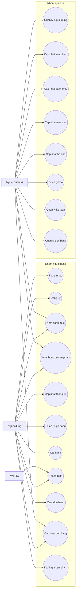
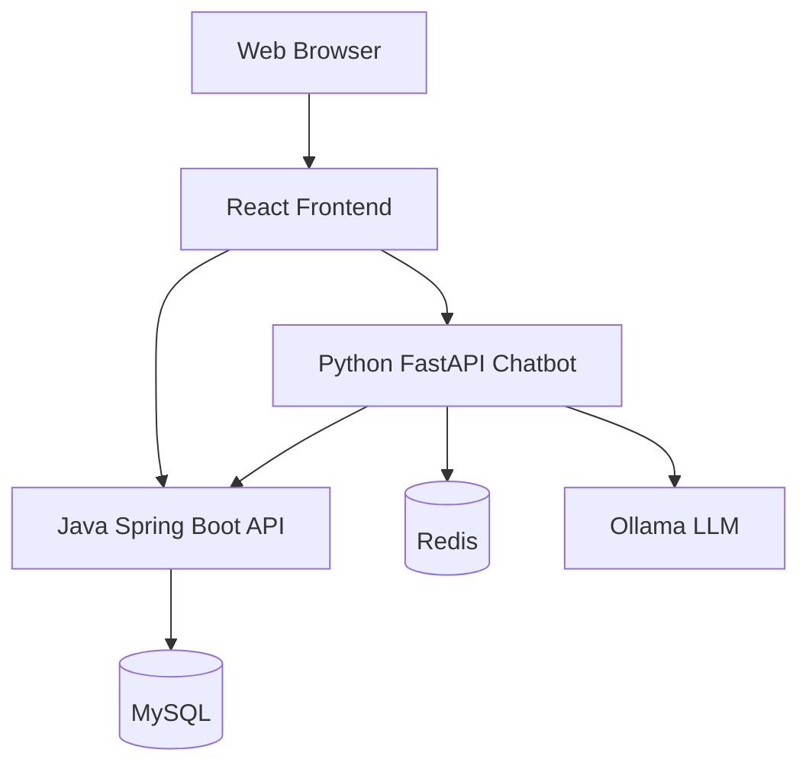
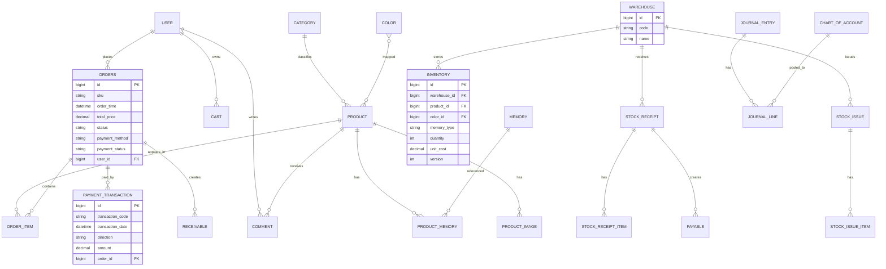
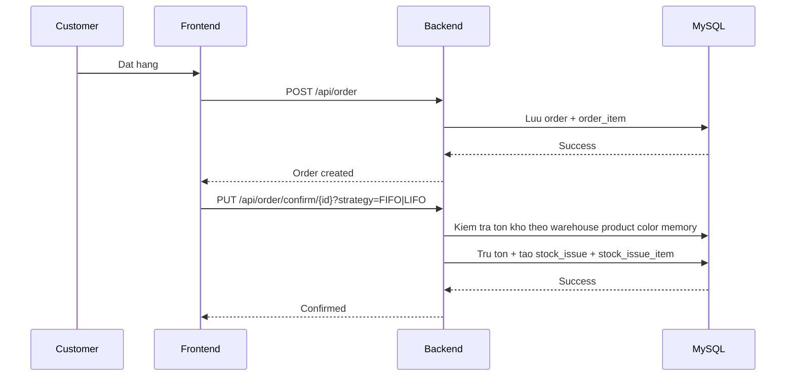
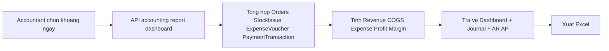

# TAI LIEU PHAN TICH NGHIEP VU VA KY THUAT - DU AN APPLESHOP

## 1. Tong quan du an

AppleShop la he thong thuong mai dien tu ban san pham Apple, bao gom:
- Frontend web cho khach hang va trang tri admin.
- Backend Java Spring Boot xu ly nghiep vu kinh doanh, kho, ke toan.
- Backend Python FastAPI cho chatbot AI tu van san pham.

### 1.1 Muc tieu he thong
- Ho tro quy trinh mua hang online tron ven (xem san pham, gio hang, dat hang, thanh toan).
- Quan tri ton kho theo kho, theo bien the mau bo nho.
- Tiền điều kiện: Người dùng đã có tài khoản hợp lệ trong hệ thống.
- Hậu điều kiện: Hệ thống trả về token đăng nhập hợp lệ và người dùng được phân quyền theo vai trò.
- Luồng chính:
  1. Người dùng mở màn hình đăng nhập và nhập tên đăng nhập, mật khẩu.
  2. Giao diện gửi request `POST /api/login` đến `UserAPI`.
  3. `UserAPI` gọi `UserService.login(userName, password)`.
  4. `UserService` truy vấn bảng `user` theo trường `username`.
  5. Hệ thống so sánh mật khẩu bằng BCrypt với trường `password`.
  6. Nếu hợp lệ, hệ thống sinh JWT token và trả về cho frontend.
- Luồng phụ:
  1. Nếu tên đăng nhập không tồn tại, hệ thống trả về lỗi “Tên người dùng không tồn tại”.
  2. Nếu mật khẩu không đúng, hệ thống trả về lỗi “Mật khẩu không chính xác”.
- Ngoại lệ:
  1. Nếu phát sinh lỗi hệ thống hoặc lỗi cơ sở dữ liệu, controller trả `400 Bad Request` kèm thông báo lỗi.
  2. Nếu dữ liệu đầu vào thiếu, hệ thống không sinh token và dừng use case.
- Nhan vien quan ly san pham.
- Nhan vien kho.
- Tiền điều kiện: Người dùng chưa có tài khoản với username đó trong hệ thống.
- Hậu điều kiện: Bản ghi người dùng mới được tạo trong bảng `user` với vai trò mặc định là customer.
- Luồng chính:
  1. Người dùng chọn chức năng đăng ký và nhập thông tin tài khoản.
  2. Giao diện gửi request `POST /api/signup` đến `UserAPI`.
  3. `UserAPI` gọi `UserService.save(UserDTO)`.
  4. `UserService` kiểm tra `username` đã tồn tại hay chưa bằng `userRepository.findByUsername()`.
  5. Nếu hợp lệ, hệ thống gán `role = ROLE_CUSTOMER` và băm mật khẩu bằng BCrypt.
  6. Hệ thống lưu bản ghi mới vào bảng `user` và trả về `UserDTO`.
- Luồng phụ:
  1. Nếu `username` đã được sử dụng, hệ thống ném lỗi “Username đã được sử dụng”.
  2. Nếu dữ liệu nhập không hợp lệ, controller trả `400 Bad Request`.
- Ngoại lệ:
  1. Nếu lỗi lưu dữ liệu xảy ra trong quá trình ghi DB, use case kết thúc và không tạo tài khoản.
2. Quan ly danh muc san pham (category, color, memory, product).
3. Mua hang online (cart, order, payment).
- Tiền điều kiện: Bảng `category` đã có dữ liệu danh mục hợp lệ.
- Hậu điều kiện: Người dùng nhận được danh sách danh mục trên giao diện.
- Luồng chính:
  1. Người dùng mở màn hình danh mục.
  2. Giao diện gọi `GET /api/category` đến `CategoryAPI`.
  3. `CategoryAPI` gọi `CategoryService.getAllCategory()`.
  4. Service truy vấn toàn bộ bản ghi trong bảng `category`.
  5. Mỗi bản ghi được chuyển sang `CategoryDTO` và trả về frontend.
- Luồng phụ:
  1. Nếu danh sách rỗng, hệ thống trả về danh sách trống để giao diện hiển thị trạng thái không có dữ liệu.
- Ngoại lệ:
  1. Nếu lỗi truy vấn CSDL xảy ra, API dừng xử lý và trả lỗi cho frontend.
- Tru ton kho theo chien luoc FIFO hoac LIFO khi xac nhan don.
- Ton kho duoc quan ly theo to hop: kho + san pham + mau + bo nho.
- Tiền điều kiện: Sản phẩm đã tồn tại trong bảng `product` và chưa bị xóa.
- Hậu điều kiện: Giao diện nhận được thông tin chi tiết sản phẩm, ảnh, màu sắc, bộ nhớ và tồn kho biến thể.
- Luồng chính:
  1. Người dùng mở trang danh sách hoặc trang chi tiết sản phẩm.
  2. Giao diện gọi `GET /api/product`, `GET /api/product/{device}` hoặc `GET /api/product/code/{code}`.
  3. `ProductAPI` gọi các hàm tương ứng trong `ProductService`.
  4. Service đọc dữ liệu từ các bảng `product`, `product_image`, `product_memory`, `product_color`, `comment`, `inventory`.
  5. Với `getProductByCode()`, hệ thống còn gọi `buildVariantStocks()` để dựng số lượng tồn theo từng `memoryType` và `color`.
  6. Hệ thống trả về `ProductDTO` hoặc `List<ProductDTO>` cho frontend.
- Luồng phụ:
  1. Nếu tìm theo `code` không thấy sản phẩm, hệ thống ném lỗi “Không tìm thấy sản phẩm”.
  2. Nếu có biến thể không còn tồn kho, frontend vẫn nhận được thông tin sản phẩm nhưng số lượng hiển thị bằng 0.
- Ngoại lệ:
  1. Nếu lỗi đọc bảng liên quan, API trả lỗi và không tạo dữ liệu giả.
- Nguoi dung
- Nguoi quan tri
- Tiền điều kiện: Người dùng đã đăng nhập và có quyền sửa thông tin của chính mình.
- Hậu điều kiện: Thông tin cá nhân trong bảng `user` được cập nhật thành công.
- Luồng chính:
  1. Người dùng mở trang hồ sơ cá nhân và thay đổi thông tin cần thiết.
  2. Giao diện gửi `PUT /api/user/{id}` đến `UserAPI`.
  3. `UserAPI` kiểm tra người dùng hiện tại qua `SecurityContextHolder` và `userRepository.findByUsername()`.
  4. Nếu hợp lệ, controller gọi `UserService.changeInfo(UserDTO, id)`.
  5. Service tìm bản ghi trong bảng `user` theo `id` và cập nhật các trường được phép.
  6. Hệ thống lưu dữ liệu và trả về thông báo “Đổi thông tin tài khoản thành công”.
- Luồng phụ:
  1. Nếu người dùng không phải admin và không phải chủ tài khoản, hệ thống trả `403 Forbidden`.
  2. Nếu không tìm thấy người dùng, hệ thống trả lỗi “Không tìm thấy người dùng”.
- Ngoại lệ:
  1. Nếu lỗi hệ thống xảy ra trong lúc lưu, API trả `400 Bad Request`.
| UC01 | Dang nhap | Nguoi dung | Xac thuc tai khoan va vao he thong |
| UC02 | Dang ky | Nguoi dung | Tao tai khoan moi cho khach hang |
- Tiền điều kiện: Người dùng đã đăng nhập và đã chọn sản phẩm, màu sắc, bộ nhớ phù hợp.
- Hậu điều kiện: Giỏ hàng trong bảng `cart` phản ánh đúng số lượng và sản phẩm hiện tại.
- Luồng chính:
  1. Người dùng bấm thêm vào giỏ hoặc chỉnh sửa giỏ hàng.
  2. Giao diện gọi `POST /api/cart`, `PUT /api/cart/{id}`, `DELETE /api/cart/{id}` hoặc `GET /api/cart/user/{id}`.
  3. `CartAPI` chuyển request đến `CartService`.
  4. `CartService` tìm bản ghi trong bảng `cart` theo bộ khóa nghiệp vụ `user_id`, `product_id`, `memory`, `color`.
  5. Nếu bản ghi đã tồn tại, hệ thống tăng `quantity`; nếu chưa có, tạo dòng mới với số lượng mặc định là 1.
  6. Hệ thống trả về `CartDTO` hoặc danh sách `CartDTO`.
- Luồng phụ:
  1. Nếu xóa một dòng giỏ hàng, service thực hiện xóa theo `id`.
  2. Nếu xóa toàn bộ giỏ theo user, service xóa tất cả bản ghi của người dùng đó.
- Ngoại lệ:
  1. Nếu lỗi lưu hoặc xóa dữ liệu, controller trả `400 Bad Request`.
| UC09 | Xem don hang | Nguoi dung | Xem lich su va chi tiet don hang |
| UC10 | Cap nhat don hang | Nguoi dung, Nguoi quan tri | Thay doi trang thai hoac thong tin don hang |
- Tiền điều kiện: Giỏ hàng có ít nhất một sản phẩm hợp lệ và người dùng đã có thông tin giao hàng.
- Hậu điều kiện: Bản ghi mới được tạo trong bảng `orders` và `order_item`.
- Luồng chính:
  1. Người dùng xác nhận đặt hàng từ giỏ hàng.
  2. Giao diện gửi `POST /api/order` đến `OrderAPI`.
  3. `OrderAPI` kiểm tra người dùng hiện tại; nếu không phải admin thì gán `userId` của tài khoản đang đăng nhập.
  4. `OrderAPI` gọi `OrderService.save(OrderDTO)`.
  5. Service lưu bản ghi vào bảng `orders` trước, sau đó lưu từng dòng vào bảng `order_item`.
  6. Hệ thống trừ tồn kho bằng `deductInventoryForOrder()` và ghi nhận kế toán bằng `AccountingPostingService.postOrderCreated()`.
  7. Hệ thống trả về `OrderDTO` của đơn hàng vừa tạo.
- Luồng phụ:
  1. Nếu đơn hàng có nhiều dòng, service xử lý từng `OrderItemDTO` tuần tự.
  2. Nếu sản phẩm hoặc biến thể không đủ tồn kho, hệ thống ném lỗi và quay lui giao dịch.
- Ngoại lệ:
  1. Nếu người dùng chưa đăng nhập, controller trả lỗi “Bạn chưa đăng nhập”.
  2. Nếu dữ liệu đơn hàng không hợp lệ, controller trả `400 Bad Request`.
| UC18 | Quan ly ke toan | Nguoi quan tri | Xem bao cao, cong no, nhat ky va dashboard |
| UC19 | Quan ly don hang | Nguoi quan tri | Theo doi, xac nhan va xu ly toan bo don hang |
- Tiền điều kiện: Đơn hàng đã được tạo và còn trạng thái có thể thanh toán.
- Hậu điều kiện: Trạng thái thanh toán của đơn hàng được cập nhật, giao dịch thanh toán và bút toán kế toán được ghi nhận.
- Luồng chính:
  1. Người dùng bấm thanh toán VNPay trên giao diện.
  2. Frontend gọi `POST /api/vnpay/create-payment-url` và nhận đường dẫn sandbox từ backend.
  3. Backend tạo đơn hàng với `paymentMethod = VNPAY_QR`, sau đó redirect sang VNPay sandbox.
  4. VNPay gọi IPN về `/api/vnpay/ipn`; nếu giao dịch hợp lệ, backend gọi `OrderService.markOrderPaid()`.
  5. `AccountingPostingService.postOrderPayment()` ghi thêm bản ghi vào `payment_transaction`, đóng công nợ trong `receivable` và tạo bút toán `journal_entry`, `journal_line` nếu chưa có.
  6. Frontend trang `/payment-result` gọi lại `GET /api/order/{id}` để hiển thị trạng thái mới nhất.
- Luồng phụ:
  1. Nếu IPN đến chậm hơn trang kết quả, trang `/payment-result` hiển thị trạng thái đang đồng bộ cho tới khi backend cập nhật xong.
  2. Nếu đơn hàng đã hủy, hệ thống từ chối đánh dấu đã thanh toán.
  3. Nếu giao dịch đã được thanh toán từ trước, hệ thống trả lại dữ liệu hiện tại mà không ghi thêm.
- Ngoại lệ:
  1. Nếu không tìm thấy đơn hàng, hệ thống trả lỗi “Không tìm thấy đơn hàng”.
  2. Nếu lỗi đồng bộ kế toán hoặc dữ liệu thanh toán, API trả `400 Bad Request`.
- Tien dieu kien: Nguoi dung da co tai khoan hop le.
- Hau dieu kien: He thong tao phien dang nhap hop le va phan quyen theo role.
- Tiền điều kiện: Người dùng đã đăng nhập; đơn hàng đã tồn tại trong hệ thống.
- Hậu điều kiện: Người dùng xem được danh sách đơn hàng và chi tiết từng đơn.
- Luồng chính:
  1. Người dùng mở trang lịch sử đơn hàng.
  2. Giao diện gọi `GET /api/order/user/{id}` hoặc `GET /api/order`.
  3. `OrderAPI` kiểm tra quyền truy cập qua `getCurrentUserOrThrow()`.
  4. Nếu hợp lệ, controller gọi `OrderService.getOrderByUserId()` hoặc `getAllOrder()`.
  5. Service đọc bảng `orders` và nạp dữ liệu con từ `order_item` để dựng `OrderDTO`.
  6. Hệ thống trả về danh sách đơn hàng cho frontend.
- Luồng phụ:
  1. Nếu người dùng xem đơn của tài khoản khác mà không phải admin, hệ thống trả `403 Forbidden`.
  2. Nếu không có đơn nào, hệ thống trả danh sách rỗng.
- Ngoại lệ:
  1. Nếu lỗi truy vấn dữ liệu, API trả `400 Bad Request`.
  1. Neu sai ten dang nhap hoac mat khau, he thong bao loi va khong cho dang nhap.
  2. Neu tai khoan bi vo hieu hoa hoac khong ton tai, he thong tu choi truy cap.
- Tiền điều kiện: Đơn hàng tồn tại và trạng thái hiện tại cho phép chuyển sang trạng thái mới.
- Hậu điều kiện: Đơn hàng được cập nhật trạng thái, và nếu cần thì tồn kho được trừ hoặc đánh dấu đã kiểm tra bình luận.
- Luồng chính:
  1. Admin hoặc người dùng được phép mở đơn hàng cần xử lý.
  2. Giao diện gửi `PUT /api/order/confirm/{id}` hoặc `PUT /api/order/change/{id}`.
  3. `OrderAPI` gọi `OrderService.updateStatusOrder()` hoặc `changeCheck()`.
  4. Service đọc bản ghi trong bảng `orders`, kiểm tra `status` hiện tại và xác minh trạng thái kế tiếp có hợp lệ không.
  5. Nếu hợp lệ, hệ thống cập nhật `status` và có thể cập nhật `payment_status` nếu request có truyền lên.
  6. Nếu cần, service trừ tồn kho theo FIFO/LIFO và đánh dấu `inventoryDeducted = true`.
  7. API trả về `OrderDTO` hoặc chuỗi `ok`.
- Luồng phụ:
  1. Nếu đơn đã ở trạng thái cuối, hệ thống không cho chuyển tiếp thêm.
  2. Nếu `changeCheck()` được gọi, hệ thống chỉ cập nhật cờ `checkCmt = 1`.
- Ngoại lệ:
  1. Nếu không tìm thấy đơn hàng, hệ thống trả lỗi.
  2. Nếu chuyển trạng thái không hợp lệ, hệ thống ném lỗi nghiệp vụ.
- Muc tieu: Tao tai khoan moi cho khach hang.
- Actor chinh: Nguoi dung.
- Tiền điều kiện: Người dùng đã đăng nhập và sản phẩm đã tồn tại.
- Hậu điều kiện: Bình luận hoặc phản hồi được lưu trong bảng `comment` và hiển thị trên trang sản phẩm.
- Luồng chính:
  1. Người dùng nhập nội dung đánh giá và điểm sao.
  2. Giao diện gọi `POST /api/comment` hoặc `POST /api/reply/{id}`.
  3. `CommentAPI` chuyển request đến `CommentService`.
  4. Service tạo hoặc cập nhật bản ghi trong bảng `comment`.
  5. Dữ liệu `comment`, `rating`, `product_id`, `user_id`, `reply`, `timeCmt`, `timeRep` được lưu tùy theo hành động.
  6. Hệ thống trả về `CommentDTO`.
- Luồng phụ:
  1. Nếu admin phản hồi, hệ thống cập nhật trường `reply` và `admin_id`.
  2. Nếu sửa phản hồi, hệ thống gọi `changeReply()`.
  3. Nếu xóa phản hồi, hệ thống chỉ đặt `reply = null`.
- Ngoại lệ:
  1. Nếu bản ghi không tồn tại khi sửa hoặc xóa, service có thể phát sinh lỗi và API trả `400 Bad Request`.
  4. He thong luu thong tin vao co so du lieu va thong bao dang ky thanh cong.
- Luong re nhanh:
- Tiền điều kiện: Người quản trị đã đăng nhập và có quyền quản lý tài khoản.
- Hậu điều kiện: Thông tin người dùng hoặc vai trò được cập nhật theo thao tác của admin.
- Luồng chính:
  1. Admin mở danh sách người dùng hoặc màn hình chi tiết tài khoản.
  2. Giao diện gọi `GET /api/user`, `GET /api/user/{id}`, `PUT /api/user/{id}`, `PUT /api/user/{id}/role` hoặc `PUT /api/user/batch/role`.
  3. `UserAPI` kiểm tra quyền admin bằng `getCurrentUserOrThrow()` và `isAdmin()`.
  4. `UserService` truy vấn và cập nhật bảng `user`.
  5. Nếu cập nhật vai trò, service kiểm tra `role` có hợp lệ hay không trước khi lưu.
  6. Hệ thống trả về `UserDTO`, `List<UserDTO>` hoặc chuỗi thông báo thành công.
- Luồng phụ:
  1. Nếu admin sửa hàng loạt vai trò, service duyệt từng phần tử trong `BatchRoleUpdateDTO`.
  2. Nếu một phần tử thiếu `userId` hoặc `role`, phần tử đó bị tính là thất bại.
- Ngoại lệ:
  1. Nếu không tìm thấy người dùng, hệ thống trả lỗi.
  2. Nếu vai trò không hợp lệ, hệ thống ném lỗi “Vai trò không hợp lệ”.

### UC13 - Cập nhật sản phẩm
- Tiền điều kiện: Quản trị viên có quyền quản lý sản phẩm và đã có dữ liệu danh mục, màu, bộ nhớ, tồn kho liên quan.
- Hậu điều kiện: Bản ghi trong bảng `product` và các bảng liên quan được cập nhật đồng bộ.
- Luồng chính:
  1. Admin mở form sản phẩm để tạo mới hoặc chỉnh sửa.
  2. Giao diện gọi `POST /api/product` hoặc `PUT /api/product/{id}`.
  3. `ProductAPI` chuyển request đến `ProductService.save(ProductDTO)`.
  4. Service kiểm tra `code`, `categoryCode`, danh sách màu và danh sách bộ nhớ.
  5. Service tìm `CategoryEntity`, `ColorEntity`, `MemoryEntity` và kiểm tra tồn kho tương ứng trong `inventory`.
  6. Nếu hợp lệ, hệ thống lưu `product`, cập nhật `product_memory`, và liên kết `product_color`.
  7. Hệ thống trả về `ProductDTO`.
- Luồng phụ:
  1. Nếu xóa sản phẩm nhưng vẫn còn tồn kho, hệ thống không cho phép xóa.
  2. Nếu bộ nhớ chưa có tồn kho, service ném lỗi và yêu cầu nhập kho trước.
- Ngoại lệ:
  1. Nếu mã sản phẩm trống, hệ thống trả lỗi “Mã sản phẩm là bắt buộc”.
  2. Nếu danh mục không tồn tại, hệ thống trả lỗi `NotFoundException`.

### UC14 - Cập nhật danh mục
- Tiền điều kiện: Người quản trị đã đăng nhập.
- Hậu điều kiện: Danh mục mới hoặc thay đổi của danh mục được lưu trong bảng `category`.
- Luồng chính:
  1. Admin mở màn hình danh mục.
  2. Giao diện gọi `POST /api/category`, `PUT /api/category/{id}`, `DELETE /api/category/{id}` hoặc `GET /api/category`.
  3. `CategoryAPI` gọi `CategoryService.save()` hoặc `CategoryService.delete()`.
  4. Service ghi hoặc cập nhật bản ghi trong bảng `category`.
  5. Hệ thống trả về `CategoryDTO` hoặc danh sách `CategoryDTO`.
- Luồng phụ:
  1. Nếu xóa danh mục đang được sản phẩm tham chiếu, hành vi phụ thuộc vào ràng buộc dữ liệu của CSDL.
- Ngoại lệ:
  1. Nếu lỗi lưu dữ liệu, controller trả `400 Bad Request`.

### UC15 - Cập nhật màu sắc
- Tiền điều kiện: Quản trị viên đã đăng nhập.
- Hậu điều kiện: Danh sách màu trong bảng `color` được cập nhật.
- Luồng chính:
  1. Admin mở màn hình quản lý màu sắc.
  2. Giao diện gọi `POST /api/color`, `PUT /api/color/{id}`, `DELETE /api/color/{id}` hoặc `GET /api/color`.
  3. `ColorAPI` chuyển request sang `ColorService`.
  4. Service lưu dữ liệu vào bảng `color` và trả về `ColorDTO`.
  5. Hệ thống trả kết quả về frontend.
- Luồng phụ:
  1. Nếu xóa màu đang được sản phẩm sử dụng, CSDL có thể ngăn xóa theo ràng buộc quan hệ.
- Ngoại lệ:
  1. Nếu lỗi lưu dữ liệu, controller trả lỗi phù hợp.

### UC16 - Cập nhật bộ nhớ
- Tiền điều kiện: Quản trị viên đã đăng nhập.
- Hậu điều kiện: Bộ nhớ mới hoặc thay đổi của bộ nhớ được lưu trong bảng `memory`.
- Luồng chính:
  1. Admin mở màn hình quản lý bộ nhớ.
  2. Giao diện gọi `POST /api/memory`, `PUT /api/memory/{id}`, `DELETE /api/memory/{id}` hoặc `GET /api/memory`.
  3. `MemoryAPI` gọi `MemoryService`.
  4. Service ghi dữ liệu vào bảng `memory` và trả về `MemoryDTO`.
- Luồng phụ:
  1. Nếu xóa bộ nhớ đang được sản phẩm hoặc tồn kho tham chiếu, hệ thống cần ràng buộc dữ liệu tương ứng từ CSDL.
- Ngoại lệ:
  1. Nếu lỗi lưu dữ liệu, controller trả lỗi phù hợp.

### UC17 - Quản lý kho
- Tiền điều kiện: Quản trị viên đã đăng nhập; kho và sản phẩm liên quan đã sẵn sàng.
- Hậu điều kiện: Bảng `warehouse`, `inventory`, `stock_receipt`, `stock_receipt_item`, `stock_issue`, `stock_issue_item` được cập nhật đúng nghiệp vụ.
- Luồng chính:
  1. Admin mở màn hình kho, phiếu nhập, phiếu xuất hoặc điều chỉnh tồn.
  2. Giao diện gọi các API như `POST /api/warehouse`, `PUT /api/warehouse/{id}`, `POST /api/stock-receipt`, `POST /api/stock-issue`, `POST /api/inventory/adjust`.
  3. `WarehouseAPI`, `StockReceiptAPI`, `StockIssueAPI`, `InventoryAPI` lần lượt gọi service tương ứng.
  4. `WarehouseService` ghi thông tin kho vào bảng `warehouse`.
  5. `StockReceiptService` tăng tồn kho trong `inventory`, tạo `stock_receipt` và `stock_receipt_item`.
  6. `StockIssueService` giảm tồn kho trong `inventory`, tạo `stock_issue` và `stock_issue_item`.
  7. `InventoryService` điều chỉnh số lượng tồn theo `quantityDelta`.
  8. Hệ thống trả về các DTO tổng hợp như `WarehouseDTO`, `StockReceiptDTO`, `StockIssueDTO`, `InventoryDTO`.
- Luồng phụ:
  1. Nếu kho không tồn tại, service trả lỗi “Không tìm thấy kho”.
  2. Nếu số lượng xuất lớn hơn tồn, hệ thống từ chối phiếu xuất.
  3. Nếu điều chỉnh làm số lượng tồn nhỏ hơn 0, hệ thống không cho lưu.
- Ngoại lệ:
  1. Nếu `quantityDelta = 0` hoặc dương trong điều chỉnh tồn, hệ thống trả lỗi nghiệp vụ.
  2. Nếu phiếu nhập không có dòng hàng hợp lệ, hệ thống trả lỗi.

### UC18 - Quản lý kế toán
- Tiền điều kiện: Hệ thống đã có dữ liệu đơn hàng, thanh toán, phiếu nhập, phiếu xuất và sổ cái.
- Hậu điều kiện: Người quản trị xem được báo cáo, dashboard, công nợ, nhật ký và số liệu đối chiếu.
- Luồng chính:
  1. Admin mở màn hình kế toán hoặc báo cáo tổng hợp.
  2. Giao diện gọi các endpoint như `GET /api/accounting/report`, `GET /api/accounting/journal`, `GET /api/accounting/ar-aging`, `GET /api/accounting/ap-aging`, `GET /api/accounting/reconciliation`, `GET /api/accounting/cash-receipts`, `GET /api/accounting/cash-payments`, `GET /api/accounting/dashboard`.
  3. `AccountingAPI` gọi `AccountingService`.
  4. Service đọc các bảng `orders`, `stock_issue`, `stock_receipt_item`, `journal_entry`, `journal_line`, `receivable`, `payable`, `payment_transaction`, `expense_voucher`, `chart_of_account`, `inventory`.
  5. Hệ thống tổng hợp doanh thu, giá vốn, lợi nhuận, công nợ, phiếu thu chi và số liệu đối chiếu.
  6. Service trả về đúng DTO cho từng màn hình.
- Luồng phụ:
  1. Nếu khoảng ngày không hợp lệ, hệ thống tự chuẩn hóa hoặc trả dữ liệu mặc định theo logic `resolveRange()`.
  2. Nếu không có dữ liệu, hệ thống vẫn trả DTO với giá trị 0 hoặc danh sách rỗng.
- Ngoại lệ:
  1. Nếu lỗi truy vấn hoặc lỗi tính toán số liệu, API trả lỗi và dừng use case.

### UC19 - Quản lý đơn hàng
- Tiền điều kiện: Đơn hàng đã tồn tại trong hệ thống.
- Hậu điều kiện: Đơn hàng được theo dõi, cập nhật và đồng bộ với thanh toán, kho, công nợ.
- Luồng chính:
  1. Admin mở danh sách đơn hàng cần theo dõi.
  2. Giao diện gọi `GET /api/order`, `GET /api/order/user/{id}`, `PUT /api/order/confirm/{id}`, `PUT /api/order/payment/{id}` hoặc `PUT /api/order/change/{id}`.
  3. `OrderAPI` chuyển yêu cầu sang `OrderService`.
  4. Service đọc và cập nhật bảng `orders` cùng các bảng liên quan như `order_item`, `inventory`, `stock_issue`, `payment_transaction`, `receivable`.
  5. Khi cần, hệ thống xác nhận đơn, đổi trạng thái, đánh dấu đã thanh toán hoặc đánh dấu cờ `checkCmt`.
  6. API trả về `OrderDTO`, danh sách `OrderDTO` hoặc chuỗi thông báo tùy hành động.
- Luồng phụ:
  1. Nếu đơn đã hoàn thành hoặc bị hủy, hệ thống giới hạn các thao tác tiếp theo.
  2. Nếu người dùng không có quyền, hệ thống trả `403 Forbidden`.
- Ngoại lệ:
  1. Nếu không tìm thấy đơn hàng, hệ thống trả lỗi `Không tìm thấy đơn hàng`.
  2. Nếu có xung đột trạng thái, service ném lỗi nghiệp vụ và controller trả `400 Bad Request`.

### UC03 - Xem danh muc
- Muc tieu: Cho phep nguoi dung xem danh sach danh muc san pham.
- Actor chinh: Nguoi dung, Nguoi quan tri.
- Tien dieu kien: He thong da co du lieu CategoryEntity.
- Hau dieu kien: Nguoi dung xem duoc danh muc va chon vao danh muc can quan tam.
- Luong chinh:
  1. Nguoi dung mo man hinh danh muc.
  2. He thong truy van CategoryEntity va cac san pham lien quan.
  3. He thong hien thi danh sach danh muc tren giao dien.
  4. Nguoi dung chon danh muc de xem san pham ben trong.
- Luong re nhanh:
  1. Neu danh muc khong co du lieu, he thong hien thi trang rong.
  2. Neu loi truy van, he thong thong bao va cho phep tai lai.
- Yeu cau dac biet: Danh muc phai hien thi dung trang thai kich hoat.
- Diem mo rong: Co the ket hop bo loc mau sac va bo nho.
- Du lieu chinh: CategoryEntity, ProductEntity.

### UC04 - Xem thong tin san pham
- Muc tieu: Cho phep nguoi dung xem chi tiet san pham truoc khi mua.
- Actor chinh: Nguoi dung, Nguoi quan tri.
- Tien dieu kien: San pham da duoc tao va dang hoat dong.
- Hau dieu kien: Nguoi dung xem duoc thong tin day du ve san pham.
- Luong chinh:
  1. Nguoi dung chon mot san pham trong danh sach.
  2. He thong lay thong tin tu ProductEntity, ProductImageEntity, ProductMemoryEntity va CommentEntity.
  3. He thong hien thi gia, mo ta, hinh anh, mau sac, bo nho va danh gia.
  4. Nguoi dung co the chuyen sang them vao gio hang hoac dat hang.
- Luong re nhanh:
  1. Neu san pham khong ton tai, he thong thong bao khong tim thay.
  2. Neu loi tai anh hoac du lieu lien quan, he thong van hien thi thong tin co san.
- Yeu cau dac biet: Phai hien thi dung bien the san pham.
- Diem mo rong: Co the them san pham vao danh sach yeu thich.
- Du lieu chinh: ProductEntity, ProductImageEntity, ProductMemoryEntity, ColorEntity, MemoryEntity, CommentEntity.

### UC05 - Cap nhat thong tin
- Muc tieu: Cho phep nguoi dung cap nhat thong tin ca nhan.
- Actor chinh: Nguoi dung.
- Tien dieu kien: Nguoi dung da dang nhap.
- Hau dieu kien: Thong tin ca nhan duoc cap nhat trong UserEntity.
- Luong chinh:
  1. Nguoi dung mo trang thong tin tai khoan.
  2. Nguoi dung chinh sua cac truong duoc phep.
  3. He thong kiem tra hop le cua du lieu.
  4. He thong luu thay doi va thong bao cap nhat thanh cong.
- Luong re nhanh:
  1. Neu nguoi dung khong co quyen cap nhat, he thong tu choi truy cap.
  2. Neu du lieu khong hop le, he thong yeu cau sua lai.
  3. Neu loi he thong, thong bao loi duoc hien thi va use case ket thuc.
- Yeu cau dac biet: Khong duoc lam thay doi cac truong quyen he thong.
- Diem mo rong: Co the cap nhat avatar hoac mat khau rieng.
- Du lieu chinh: UserEntity.

### UC06 - Quan ly gio hang
- Muc tieu: Quan ly cac san pham da chon truoc khi dat hang.
- Actor chinh: Nguoi dung.
- Tien dieu kien: Nguoi dung da dang nhap.
- Hau dieu kien: Gio hang duoc cap nhat dung so luong va tong tien.
- Luong chinh:
  1. Nguoi dung them san pham vao gio hang.
  2. He thong luu thong tin vao CartEntity va CartItemEntity.
  3. Nguoi dung co the xoa san pham hoac cap nhat so luong.
  4. He thong tinh lai tong tien va hien thi gio hang moi nhat.
- Luong re nhanh:
  1. Neu so luong vuot qua ton kho cho phep, he thong gioi han ve muc toi da.
  2. Neu san pham bi dung kinh doanh hoac khong con ton tai, he thong khong cho them vao gio.
  3. Neu loi ket noi CSDL, he thong thong bao loi va ket thuc use case.
- Yeu cau dac biet: So luong trong gio phai dong bo voi ton kho.
- Diem mo rong: Co the luu gio hang theo phien neu nguoi dung chua dang nhap.
- Du lieu chinh: CartEntity, CartItemEntity, ProductEntity, InventoryEntity.

### UC07 - Dat hang
- Muc tieu: Chuyen gio hang thanh don hang hoan chinh.
- Actor chinh: Nguoi dung.
- Tien dieu kien: Gio hang co it nhat mot san pham hop le va thong tin nhan hang day du.
- Hau dieu kien: OrderEntity va OrderItemEntity duoc tao.
- Luong chinh:
  1. Nguoi dung kiem tra lai thong tin giao nhan va danh sach san pham.
  2. He thong tao don hang moi trong OrderEntity.
  3. He thong tao danh sach OrderItemEntity tu gio hang.
  4. He thong tra ve ma don hang va trang thai ban dau.
- Luong re nhanh:
  1. Neu gio hang rong, he thong khong cho tao don.
  2. Neu thong tin giao nhan thieu, he thong yeu cau bo sung.
  3. Neu loi trong qua trinh luu, he thong quay lui giao dich va thong bao loi.
- Yeu cau dac biet: Don hang phai co ma tham chieu duy nhat.
- Diem mo rong: Co the tach chuc nang dat hang nhanh cho khach quen.
- Du lieu chinh: OrderEntity, OrderItemEntity, CartEntity, UserEntity.

### UC08 - Thanh toan
- Muc tieu: Hoan tat giao dich thanh toan don hang qua VNPay sandbox va dong bo trang thai don hang.
- Actor chinh: Nguoi dung.
- Actor phu: VNPay.
- Tien dieu kien: Don hang da duoc tao tu du lieu checkout va nguoi dung chon thanh toan VNPay.
- Hau dieu kien: Don hang duoc cap nhat `paymentStatus = Đã thanh toán`, co giao dich ke toan va gio hang duoc xoa sau khi IPN xac nhan thanh cong.
- Luong chinh:
  1. Nguoi dung bam nut thanh toan VNPay tren giao dien.
  2. Frontend gui `POST /api/vnpay/create-payment-url` kem `order` va `returnUrl`.
  3. `VnpayAPI` goi `VnpayService.createPaymentUrl()`.
  4. Service tao don hang voi `paymentMethod = VNPAY_QR`, sinh payment URL sandbox va tra ve `paymentUrl`, `orderId`, `sku`.
  5. Frontend redirect nguoi dung sang cong VNPay sandbox.
  6. Sau khi thanh toan, VNPay redirect nguoi dung ve `/payment-result` va dong thoi goi IPN toi `/api/vnpay/ipn`.
  7. IPN xac thuc chu ky, doi chieu so tien, goi `OrderService.markOrderPaid()` va xoa gio hang cua nguoi dung bang `CartService.deleteByUserId()`.
  8. Trang `/payment-result` goi lai `GET /api/order/{id}` de tu dong dong bo va hien thi trang thai don hang moi nhat.
- Luong re nhanh:
  1. Neu IPN den cham hon return redirect, trang ket qua hien thi trang thai dang dong bo trong vai giay.
  2. Neu thanh toan VNPay that bai, don hang van giu trang thai chua thanh toan.
  3. Neu chu ky hoac so tien khong hop le, IPN bi tu choi va khong cap nhat don hang.
- Yeu cau dac biet: Phai bao toan chu ky, doi chieu amount va chi dong bo trang thai sau khi IPN hop le.
- Diem mo rong: Co the ho tro cac phuong thuc thanh toan khac nhau, nhung VNPay sandbox hien tai la luong chinh.
- Du lieu chinh: OrderEntity, OrderItemEntity, PaymentTransactionEntity, CartEntity, UserEntity.

#### UC08.1 - Trinh tu xu ly ky thuat
- Diem bat dau use case:
  - Use case bat dau khi nguoi dung bam nut thanh toan VNPay tren giao dien [pages/payment/index.js](../appleshop-ui/src/pages/payment/index.js).
  - Frontend lay `checkoutData` tu gio hang, gan `paymentMethod = VNPAY_QR` va goi `POST /api/vnpay/create-payment-url`.
  - Backend tra ve `paymentUrl`; frontend dieu huong nguoi dung sang VNPay sandbox.

- Controller va service bat dau xu ly:
  - `VnpayAPI.createPaymentUrl(request)` nhan du lieu checkout va `returnUrl`.
  - `VnpayService.createPaymentUrl()` tao don hang, sinh URL thanh toan va tra ve `orderId`.
  - `VnpayAPI.ipn()` nhan callback tu VNPay va goi `VnpayService.processIpn()`.

- Kiem tra va cap nhat tren bang `orders`:
  - `VnpayService.createPaymentUrl()` goi `orderService.save(orderDTO)` de tao don hang truoc khi redirect sang VNPay.
  - Don hang duoc tao voi `paymentMethod = VNPAY_QR` va trang thai chua thanh toan.
  - `VnpayService.processIpn()` tim don hang bang `orderRepository.findById(orderId)`.
  - Neu khong tim thay, he thong tra `RspCode = 01` va khong cap nhat DB.
  - Neu `vnp_Amount` khong khop so voi `order.totalPrice`, he thong tra `RspCode = 04` va khong cap nhat DB.
  - Neu `vnp_ResponseCode = 00` va `vnp_TransactionStatus = 00`, he thong goi `OrderService.markOrderPaid(orderId)`.

- Truong duoc doc va check tren bang `orders`:
  - `id`: tim don hang.
  - `status`: kiem tra luong trang thai hop le.
  - `payment_status`: xac dinh don da thanh toan hay chua.
  - `payment_method`: lay phuong thuc thanh toan de ghi vao giao dich.
  - `paid_time`: danh dau thoi diem thanh toan thanh cong.
  - `sku`: dung lam ma tham chieu trong phieu thanh toan va but toan.
  - `total_price`: dung lam gia tri thanh toan.
  - `user_id`: lien ket nguoi mua.

- Cac bang bi ghi/ cap nhat tiep theo:
  - `payment_transaction`: duoc tao trong `AccountingPostingService.postOrderPayment()` khi don hang da thanh toan.
  - `receivable`: tim theo ma `AR-ORD-{orderId}` va dong so du cong no sau khi thanh toan.
  - `journal_entry` va `journal_line`: tao but toan co du va chi tao neu chua ton tai.
  - `cart`: duoc xoa theo `userId` sau khi IPN xac nhan thanh cong.

- Kiem tra va cap nhat tren bang `payment_transaction`:
  - `OrderService.markOrderPaid()` va `AccountingPostingService.postOrderPayment()` tao giao dich voi `transaction_code = PAY-ORD-{orderId}`.
  - Neu chua co, he thong tao ban ghi moi.
  - Cac truong duoc set:
    - `transaction_code`: ma giao dich duy nhat.
    - `transaction_date`: lay tu `paid_time`, neu null thi lay thoi diem hien tai.
    - `method`: lay tu `order.paymentMethod`, neu null thi gan `UNKNOWN`.
    - `direction`: gan `IN`.
    - `status`: gan `SUCCESS`.
    - `amount`: lay tu so du cong no can thu.
    - `reference_no`: gan `order.sku`.
    - `order_id`: lien ket don hang.
    - `data_version`: phuc vu dong bo du lieu.
  - Ket qua la mot giao dich thanh toan duoc luu de doi soat sau nay.

- Kiem tra va cap nhat tren bang `receivable`:
  - Service tim `receivable` theo `documentCode = AR-ORD-{orderId}`.
  - Neu khong co receivable, he thong bo qua buoc dong cong no.
  - Neu co, he thong cap nhat:
    - `outstanding_amount = 0`
    - `status = CLOSED`
    - `data_version` tang len.
  - Buoc nay dam bao don hang da thanh toan khong con cong no mo.

- Kiem tra va cap nhat tren bang `journal_entry` va `journal_line`:
  - He thong goi `createBalancedJournalIfMissing(...)` trong `AccountingPostingService`.
  - Neu chua co but toan cung `sourceType`, `sourceId`, `entryType`, he thong tao moi.
  - But toan duoc gan:
    - `entry_number`
    - `entry_date`
    - `entry_type`
    - `source_type`
    - `source_id`
    - `source_code`
    - `description`
    - `posting_status = POSTED`
  - Cac dong `journal_line` se duoc sinh theo co che no/co tuong ung.

- Ket qua tra ve cho controller:
  - `VnpayService.processIpn()` tra ve map response cho VNPay voi `RspCode` va `Message`.
  - `OrderService.markOrderPaid()` tra ve `OrderDTO` da cap nhat.
  - `OrderAPI.getOrderById()` duoc trang `/payment-result` goi lai de lay trang thai moi nhat.
  - `OrderDTO` tra ve se chua trang thai moi nhat cua don hang, bao gom:
    - `id`
    - `sku`
    - `status`
    - `paymentStatus`
    - `paidTime`
    - `paymentMethod`
    - `totalPrice`
    - `orderItemDTOs`

- Lua do nghiep vu theo dung thu tu:
  1. Tao don hang tu du lieu checkout.
  2. Redirect sang VNPay sandbox.
  3. Nhan IPN va xac thuc chu ky/so tien.
  4. Cap nhat `orders.payment_status` va `orders.paid_time`.
  5. Tao/ghi `payment_transaction`.
  6. Dong `receivable` va xoa gio hang.
  7. Trang `/payment-result` goi lai order de dong bo trang thai.

- Ghi chu ve VN Pay trong code hien tai:
  - Backend hien tai da co controller VNPay rieng la `VnpayAPI`.
  - IPN duoc mo public trong `SecurityConfig` cho `GET` va `POST`.
  - Frontend co trang `/payment-result` de tu dong dong bo trang thai don hang sau khi VNPay tra ve.

#### UC08.2 - Bang mapping chi tiet

| Buoc | Controller / Service | Bang bi tac dong | Truong doc | Truong ghi / cap nhat | Ket qua tra ve |
|---|---|---|---|---|---|
| 1 | `VnpayAPI.createPaymentUrl(request)` | Khong tac dong DB | `order`, `returnUrl` | Khong co | Tra `paymentUrl`, `orderId`, `sku` |
| 2 | `VnpayService.createPaymentUrl()` | `orders` | `orderDTO`, `totalPrice`, `userId` | `paymentMethod = VNPAY_QR`, `payment_status = Chua thanh toan` | URL thanh toan sandbox |
| 3 | `VnpayAPI.ipn(params)` / `VnpayService.processIpn()` | `orders` | `vnp_SecureHash`, `vnp_TxnRef`, `vnp_Amount`, `vnp_ResponseCode`, `vnp_TransactionStatus` | `payment_status`, `paid_time` | `RspCode`, `Message` |
| 4 | `OrderService.markOrderPaid()` | `payment_transaction`, `receivable`, `journal_entry`, `journal_line` | `orderId`, `paymentMethod`, `sku`, `totalPrice` | Ghi giao dich va dong cong no | `OrderDTO` sau cap nhat |
| 5 | `CartService.deleteByUserId()` | `cart` | `userId` | Xoa gio hang sau thanh toan thanh cong | Khong tra body |
| 6 | `OrderAPI.getOrderById()` | Khong tac dong DB | `id` tu URL | Khong co | `OrderDTO` de trang ket qua tu dong dong bo |

#### UC08.3 - Ket qua nghiep vu
- Neu thanh toan thanh cong:
  - Don hang co trang thai thanh toan moi.
  - Giao dich thanh toan duoc ghi nhan va cong no lien quan duoc dong.
  - Gio hang cua nguoi dung duoc xoa.
  - Trang `/payment-result` co the hien thi `Đã thanh toán` sau khi polling lay duoc order moi nhat.
- Neu thanh toan that bai:
  - `orders.payment_status` khong doi.
  - Khong sinh giao dich thanh toan moi.
  - Trang ket qua van hien thi trang thai that bai va cho nguoi dung thu lai.
- Neu du lieu khong hop le:
  - IPN tra lai `RspCode` phu hop va khong ghi DB.

### UC09 - Xem don hang
- Muc tieu: Cho phep nguoi dung xem lich su va chi tiet don hang da dat.
- Actor chinh: Nguoi dung.
- Tien dieu kien: Nguoi dung da dang nhap.
- Hau dieu kien: Danh sach don hang cua nguoi dung duoc hien thi.
- Luong chinh:
  1. Nguoi dung mo trang don hang.
  2. He thong truy van cac don hang theo UserEntity.
  3. He thong hien thi trang thai, tong tien va ngay dat.
  4. Nguoi dung chon mot don de xem chi tiet OrderItemEntity.
- Luong re nhanh:
  1. Neu khong co don hang nao, he thong hien thi trang thai rong.
  2. Neu nguoi dung khong co quyen xem don cua tai khoan khac, he thong tu choi truy cap.
- Yeu cau dac biet: Phai phan biet don cua tung tai khoan.
- Diem mo rong: Co the loc don theo trang thai hoac khoang ngay.
- Du lieu chinh: OrderEntity, OrderItemEntity, PaymentTransactionEntity.

### UC10 - Cap nhat don hang
- Muc tieu: Cho phep nguoi dung hoac quan tri vien cap nhat don hang trong pham vi duoc phep.
- Actor chinh: Nguoi dung, Nguoi quan tri.
- Tien dieu kien: Don hang ton tai va trang thai hien tai cho phep cap nhat.
- Hau dieu kien: Don hang duoc cap nhat trang thai hoac thong tin lien quan.
- Luong chinh:
  1. Nguoi dung hoac quan tri chon don hang can xu ly.
  2. He thong kiem tra quyen va trang thai hien tai cua don hang.
  3. Neu hop le, he thong cap nhat OrderEntity.
  4. He thong tra ve thong tin don hang moi nhat.
- Luong re nhanh:
  1. Neu don da duoc xac nhan hoac giao, he thong co the chan sua thong tin co ban.
  2. Neu nguoi dung khong co quyen, he thong tu choi cap nhat.
  3. Neu xay ra xung dot du lieu, he thong bao loi va khong luu thay doi.
- Yeu cau dac biet: Quy tac cap nhat phai phu hop voi trang thai don.
- Diem mo rong: Co the thu hoi don hang trong thoi gian cho xu ly.
- Du lieu chinh: OrderEntity, OrderItemEntity, InventoryEntity, StockIssueEntity.

### UC11 - Danh gia san pham
- Muc tieu: Cho phep nguoi dung gui binh luan va danh gia san pham.
- Actor chinh: Nguoi dung.
- Tien dieu kien: Nguoi dung da dang nhap va da xem san pham.
- Hau dieu kien: CommentEntity duoc tao va hien thi tren trang san pham.
- Luong chinh:
  1. Nguoi dung nhap noi dung danh gia va diem sao.
  2. He thong kiem tra du lieu va lien ket voi san pham.
  3. He thong luu CommentEntity vao co so du lieu.
  4. He thong cap nhat lai danh sach danh gia tren giao dien.
- Luong re nhanh:
  1. Neu danh gia khong hop le, he thong yeu cau nhap lai.
  2. Neu nguoi dung chua dang nhap, he thong yeu cau dang nhap truoc.
  3. Neu loi khi luu binh luan, he thong thong bao loi va ket thuc use case.
- Yeu cau dac biet: Chi chap nhan noi dung hop le va khong vi pham quy dinh.
- Diem mo rong: Co the chuc nang sua/xoa binh luan cua chinh nguoi dung.
- Du lieu chinh: CommentEntity, ProductEntity, UserEntity.

### UC12 - Quan ly nguoi dung
- Muc tieu: Cho phep quan tri vien quan ly tai khoan nguoi dung.
- Actor chinh: Nguoi quan tri.
- Tien dieu kien: Quan tri vien da dang nhap va co quyen quan ly nguoi dung.
- Hau dieu kien: Du lieu nguoi dung hoac quyen truy cap duoc cap nhat.
- Luong chinh:
  1. Quan tri vien mo man hinh danh sach nguoi dung.
  2. He thong hien thi danh sach UserEntity va phan quyen hien tai.
  3. Quan tri vien co the cap nhat thong tin, cap quyen hoac xoa tai khoan.
  4. He thong luu thay doi va cap nhat giao dien.
- Luong re nhanh:
  1. Neu nguoi dung khong ton tai, he thong thong bao khong tim thay.
  2. Neu quan tri vien khong co quyen, he thong tu choi truy cap.
  3. Neu loi khi cap nhat batch, he thong bao loi va giu nguyen trang thai cu.
- Yeu cau dac biet: Khong duoc tu y xoa tai khoan he thong quan trong.
- Diem mo rong: Co the them chuc nang tim kiem va loc theo role.
- Du lieu chinh: UserEntity, BatchRoleUpdateDTO.

### UC13 - Cap nhat san pham
- Muc tieu: Cho phep quan tri vien tao moi va chinh sua san pham.
- Actor chinh: Nguoi quan tri.
- Tien dieu kien: Quan tri vien da dang nhap va co quyen quan ly san pham.
- Hau dieu kien: ProductEntity va cac du lieu lien quan duoc cap nhat.
- Luong chinh:
  1. Quan tri vien mo form san pham.
  2. Nguoi dung tao moi hoac chinh sua gia, mo ta, trang thai, hinh anh.
  3. He thong luu du lieu vao ProductEntity va cac entity lien quan.
  4. He thong dong bo san pham len giao dien khach hang.
- Luong re nhanh:
  1. Neu ma san pham bi trung, he thong tu choi luu.
  2. Neu hinh anh hoac bien the khong hop le, he thong bao loi.
  3. Neu san pham dang duoc tham chieu boi don hang, he thong canh bao truoc khi xoa.
- Yeu cau dac biet: Du lieu san pham phai dong bo voi danh muc, mau va bo nho.
- Diem mo rong: Co the ho tro nhap/xuat du lieu san pham bang file.
- Du lieu chinh: ProductEntity, ProductImageEntity, ProductMemoryEntity, CategoryEntity, ColorEntity, MemoryEntity.

### UC14 - Cap nhat danh muc
- Muc tieu: Quan tri cac danh muc san pham.
- Actor chinh: Nguoi quan tri.
- Tien dieu kien: Quan tri vien da dang nhap.
- Hau dieu kien: CategoryEntity duoc tao, sua hoac xoa theo quyen.
- Luong chinh:
  1. Quan tri vien mo man hinh danh muc.
  2. He thong hien thi danh sach CategoryEntity.
  3. Quan tri vien them moi, chinh sua hoac xoa danh muc.
  4. He thong cap nhat lai du lieu tren cac man hinh lien quan.
- Luong re nhanh:
  1. Neu danh muc dang co san pham tham chieu, he thong co the canh bao truoc khi xoa.
  2. Neu ten hoac ma danh muc bi trung, he thong khong cho luu.
  3. Neu loi CSDL, he thong thong bao loi va dung use case.
- Yeu cau dac biet: Danh muc phai duoc dung ten nhat quan tren toan he thong.
- Diem mo rong: Co the them sap xep danh muc theo thu tu hien thi.
- Du lieu chinh: CategoryEntity.

### UC15 - Cap nhat mau sac
- Muc tieu: Quan tri danh sach mau sac san pham.
- Actor chinh: Nguoi quan tri.
- Tien dieu kien: Quan tri vien da dang nhap.
- Hau dieu kien: ColorEntity duoc cap nhat dung quy uoc.
- Luong chinh:
  1. Quan tri vien mo man hinh quan ly mau sac.
  2. He thong hien thi danh sach ColorEntity.
  3. Quan tri vien them, sua, xoa mau sac.
  4. He thong luu thay doi va cap nhat cac san pham dang dung mau sac do.
- Luong re nhanh:
  1. Neu mau sac bi trung ma hoac trung ten, he thong tu choi luu.
  2. Neu mau sac dang duoc san pham tham chieu, he thong canh bao khi xoa.
- Yeu cau dac biet: Gia tri mau phai phu hop cho giao dien va tim kiem.
- Diem mo rong: Co the luu them ma RGB hoac hex.
- Du lieu chinh: ColorEntity.

### UC16 - Cap nhat bo nho
- Muc tieu: Quan tri cac dung luong bo nho san pham.
- Actor chinh: Nguoi quan tri.
- Tien dieu kien: Quan tri vien da dang nhap.
- Hau dieu kien: MemoryEntity duoc cap nhat va san pham co the gan lai bien the.
- Luong chinh:
  1. Quan tri vien mo man hinh bo nho.
  2. He thong hien thi danh sach MemoryEntity.
  3. Quan tri vien them, sua, xoa gia tri bo nho.
  4. He thong cap nhat du lieu va dong bo san pham lien quan.
- Luong re nhanh:
  1. Neu bo nho dang duoc san pham su dung, he thong canh bao khi xoa.
  2. Neu du lieu khong hop le, he thong yeu cau nhap lai.
- Yeu cau dac biet: Danh sach bo nho phai thong nhat tren toan bo san pham.
- Diem mo rong: Co the phan loai bo nho theo nhom dung luong.
- Du lieu chinh: MemoryEntity.

### UC17 - Quan ly kho
- Muc tieu: Quan ly kho, ton kho va cac nghiep vu nhap xuat lien quan.
- Actor chinh: Nguoi quan tri.
- Tien dieu kien: Da co danh muc kho va san pham can quan ly.
- Hau dieu kien: WarehouseEntity, InventoryEntity va cac phieu nhap/xuat duoc cap nhat.
- Luong chinh:
  1. Quan tri vien mo man hinh kho.
  2. He thong hien thi thong tin kho va ton kho theo tung san pham.
  3. Quan tri vien tao phieu nhap, phieu xuat hoac dieu chinh ton.
  4. He thong cap nhat InventoryEntity va ghi nhan lich su bien dong.
- Luong re nhanh:
  1. Neu so luong xuat lon hon ton kho, he thong tu choi.
  2. Neu kho khong ton tai hoac khong hop le, he thong thong bao loi.
  3. Neu xay ra xung dot cap nhat, he thong bao conflict de xu ly lai.
- Yeu cau dac biet: Ton kho phai dong bo voi don hang va phieu kho.
- Diem mo rong: Co the ho tro tinh ton theo lo nhap FIFO/LIFO.
- Du lieu chinh: WarehouseEntity, InventoryEntity, StockReceiptEntity, StockIssueEntity, InventoryMovementLedgerEntity.

### UC18 - Quan ly ke toan
- Muc tieu: Cung cap bao cao va cong cu ke toan tong hop.
- Actor chinh: Nguoi quan tri.
- Tien dieu kien: He thong da co du lieu don hang, thanh toan va phat sinh ke toan.
- Hau dieu kien: Bao cao, dashboard, cong no va nhat ky ke toan duoc hien thi dung.
- Luong chinh:
  1. Quan tri vien mo man hinh ke toan.
  2. He thong tong hop du lieu tu OrderEntity, PaymentTransactionEntity, ReceivableEntity, PayableEntity va JournalEntryEntity.
  3. He thong hien thi doanh thu, gia von, loi nhuan, cong no va nhat ky.
  4. Quan tri vien co the loc theo khoang ngay va xuat bao cao neu can.
- Luong re nhanh:
  1. Neu khoang ngay khong hop le, he thong khong cho truy van.
  2. Neu khong co du lieu, he thong hien thi trang thai rong va gia tri 0.
  3. Neu loi tong hop, he thong thong bao loi va ket thuc use case.
- Yeu cau dac biet: Bao cao phai nhat quan voi du lieu ke toan da post.
- Diem mo rong: Co the them phan tich xu huong va du bao.
- Du lieu chinh: AccountingDashboardDTO, AccountingReportDTO, JournalEntryEntity, JournalLineEntity, ReceivableEntity, PayableEntity, PaymentTransactionEntity, ExpenseVoucherEntity.

### UC19 - Quan ly don hang
- Muc tieu: Cho phep quan tri vien theo doi va xu ly toan bo don hang.
- Actor chinh: Nguoi quan tri.
- Tien dieu kien: Don hang da duoc tao trong he thong.
- Hau dieu kien: Don hang duoc phan loai, xac nhan hoac cap nhat trang thai dung quy trinh.
- Luong chinh:
  1. Quan tri vien mo danh sach don hang.
  2. He thong hien thi OrderEntity theo trang thai, ngay tao, khach hang.
  3. Quan tri vien xem chi tiet, xac nhan, huy hoac cap nhat don.
  4. He thong dong bo trang thai don hang voi thanh toan va kho.
- Luong re nhanh:
  1. Neu don hang da xu ly xong, he thong chan sua nhung truong khong hop le.
  2. Neu khong co quyen, he thong tu choi truy cap.
  3. Neu cap nhat that bai, he thong thong bao va giu nguyen trang thai cu.
- Yeu cau dac biet: Trang thai don hang phai dong bo voi tien trinh giao nhan va thanh toan.
- Diem mo rong: Co the them bo loc nang cao va lich su thao tac tren don hang.
- Du lieu chinh: OrderEntity, OrderItemEntity, PaymentTransactionEntity, StockIssueEntity, ReceivableEntity.

## 3.4 Use case diagram (tong quan)

## 3.5 Phan tich ky thuat chi tiet theo use case

### UC01 - Dang nhap
- Bat dau khi nguoi dung gui form dang nhap.
- Controller nhan request la `POST /api/login` trong `UserAPI`.
- Service xu ly la `UserService.login(userName, password)`.
- Bang duoc doc la `user`; truong kiem tra gom `username` va `password`.
- He thong tim user theo username, so sanh mat khau bang BCrypt, neu dung thi sinh JWT token.
- Response tra ve la `ResponseEntity<String>` chua token; neu loi tra `400` voi thong diep.

### UC02 - Dang ky
- Bat dau khi nguoi dung gui thong tin tao tai khoan.
- Controller nhan request la `POST /api/signup` trong `UserAPI`.
- Service xu ly la `UserService.save(UserDTO)`.
- Bang duoc ghi la `user`; he thong check `username` trung, gan `role = customer`, hash `password`.
- Sau khi luu, he thong tra ve `UserDTO` cua tai khoan moi tao.
- Neu trung username hoac du lieu khong hop le, controller tra `400`.

### UC03 - Xem danh muc
- Bat dau khi giao dien goi lay danh sach danh muc.
- Controller nhan request la `GET /api/category` trong `CategoryAPI`.
- Service xu ly la `CategoryService.getAllCategory()`.
- Bang duoc doc la `category`.
- Moi dong duoc chuyen sang `CategoryDTO`; khong co thao tac ghi DB trong luong nay.
- Neu nguoi dung co quyen quan tri, cung endpoint nay van tra ve danh sach day du.

### UC04 - Xem thong tin san pham
- Bat dau khi nguoi dung mo chi tiet san pham hoac trang list san pham.
- Controller nhan `GET /api/product`, `GET /api/product/{device}`, hoac `GET /api/product/code/{code}` trong `ProductAPI`.
- Service xu ly la `ProductService.getAllProduct()`, `getProductByCategory()`, `getProductByCode()`.
- Cac bang duoc doc gom `product`, `product_image`, `product_memory`, `product_color`, `comment`, `inventory`.
- `getProductByCode()` con goi `buildVariantStocks()` de lay so luong ton theo `memoryType` va `color`.
- Response tra ve la `List<ProductDTO>` hoac `ProductDTO` co them `variantStocks`.

### UC05 - Cap nhat thong tin
- Bat dau khi nguoi dung mo trang tai khoan va bam luu thay doi.
- Controller nhan `PUT /api/user/{id}` trong `UserAPI`.
- Controller kiem tra session dang nhap bang `SecurityContextHolder` va `UserRepository.findByUsername()`.
- Service xu ly la `UserService.changeInfo(UserDTO, id)`.
- Bang duoc cap nhat la `user`; truong duoc doi thuong la thong tin ca nhan nhu ten, email, so dien thoai, dia chi, gioi tinh.
- Neu khong tim thay user, tra ve thong diep loi; neu thanh cong tra `ResponseEntity<String>` voi thong bao cap nhat thanh cong.

### UC06 - Quan ly gio hang
- Bat dau khi nguoi dung bam them vao gio hoac sua so luong trong cart.
- Controller chinh la `CartAPI` voi `POST /api/cart`, `PUT /api/cart/{id}`, `DELETE /api/cart/{id}`, `GET /api/cart/user/{id}`.
- Service xu ly la `CartService.save()`, `delete()`, `getCartByUserId()`, `deleteByUserId()`.
- Bang duoc doc/ghi la `cart`; truong trung lap de tim dong giong nhau la `user_id`, `product_id`, `memory`, `color`.
- Neu dong da ton tai va them moi, service tang `quantity` len 1; neu khong co, tao moi dong co so luong 1.
- Response tra ve la `CartDTO` hoac `List<CartDTO>`; xoa tra `void`.

### UC07 - Dat hang
- Bat dau khi nguoi dung xac nhan dat hang tu gio.
- Controller nhan `POST /api/order` trong `OrderAPI`.
- Service xu ly la `OrderService.save(OrderDTO)`.
- Bang duoc ghi la `orders` va `order_item`.
- Truoc khi luu, controller gan `userId` cua tai khoan dang nhap neu khong phai admin.
- Sau khi luu don va item, service tru ton kho bang `deductInventoryForOrder()` va dong bo ke toan qua `AccountingPostingService.postOrderCreated()`.
- Response tra ve `OrderDTO` cua don hang vua tao.

### UC08 - Thanh toan
- Bat dau khi nguoi dung chon thanh toan VNPay tren trang thanh toan.
- Controller lien quan la `VnpayAPI` voi `POST /api/vnpay/create-payment-url` va `GET|POST /api/vnpay/ipn`.
- Service xu ly la `VnpayService.createPaymentUrl()`, `VnpayService.processIpn()`; ke toan dung `OrderService.markOrderPaid()` va `AccountingPostingService.postOrderPayment()`.
- Bang duoc doc/ghi la `orders`, `payment_transaction`, `receivable`, `journal_entry`, `journal_line`, `cart`.
- Truong check chinh gom `payment_status`, `paid_time`, `payment_method`, `status`, `total_price`, `sku`, `user_id`, `vnp_TxnRef`, `vnp_Amount`, `vnp_ResponseCode`, `vnp_TransactionStatus`.
- Ket qua tra ve la payment URL, IPN response hoac `OrderDTO` sau khi dong bo thanh cong.

### UC09 - Xem don hang
- Bat dau khi nguoi dung mo man hinh lich su don hang.
- Controller nhan `GET /api/order/user/{id}` trong `OrderAPI`; `GET /api/order` tra toan bo don.
- Service xu ly la `OrderService.getOrderByUserId()` va `getAllOrder()`.
- Bang duoc doc la `orders` va bang con `order_item`; du lieu payment lay tu `orders.payment_status` va `payment_transaction` neu co.
- Controller kiem tra quyen: neu khong phai admin va khong phai chu tai khoan thi tra `403`.
- Response tra ve `List<OrderDTO>`.

### UC10 - Cap nhat don hang
- Bat dau khi admin hoac nguoi dung duoc phep thay doi trang thai don.
- Controller nhan `PUT /api/order/confirm/{id}` va `PUT /api/order/change/{id}`.
- Service xu ly la `OrderService.updateStatusOrder()` va `changeCheck()`.
- Bang duoc doc/ghi la `orders`, `order_item`, `inventory`, `stock_issue`.
- He thong check trang thai hien tai va chi cho phep chuyen qua cac trang thai hop le; neu can thi tru ton kho theo FIFO/LIFO va set `inventoryDeducted = true`.
- Ket qua tra ve la `OrderDTO` hoac chuoi `ok` voi `changeCheck()`.

### UC11 - Danh gia san pham
- Bat dau khi nguoi dung gui binh luan hoac admin tra loi binh luan.
- Controller nhan `POST /api/comment`, `POST /api/reply/{id}`, `PUT /api/comment/{id}`, `PUT /api/reply/{id}`, `DELETE /api/comment/{id}`, `DELETE /api/reply/{id}`.
- Service xu ly la `CommentService.save()`, `saveReply()`, `changeComment()`, `changeReply()`, `delete()`, `deleteReply()`.
- Bang duoc ghi la `comment`; truong chinh gom `comment`, `reply`, `rating`, `timeCmt`, `timeRep`, `admin_id`, `product_id`, `user_id`.
- `deleteReply()` khong xoa dong comment ma chi set `reply = null`.
- Response tra ve `CommentDTO` hoac khong tra body voi cac endpoint xoa.

### UC12 - Quan ly nguoi dung
- Bat dau khi admin mo danh sach tai khoan hoac thao tac vai tro.
- Controller nhan `GET /api/user`, `GET /api/user/{id}`, `DELETE /api/user/{id}`, `PUT /api/user/{id}`, `PUT /api/user/{id}/role`, `PUT /api/user/batch/role`.
- Service xu ly la `UserService.getAllUser()`, `getUserById()`, `delete()`, `changeInfo()`, `updateRole()`, `updateRoleBatch()`.
- Bang duoc doc/ghi la `user`; truong check chinh la `role`, `username`, `password`, thong tin ca nhan.
- `updateRole()` chi chap nhan cac gia tri role hop le; `updateRoleBatch()` tra thong bao so luong thanh cong that bai.
- Response tra ve `List<UserDTO>`, `UserDTO` hoac `ResponseEntity<String>`.

### UC13 - Cap nhat san pham
- Bat dau khi admin them moi, sua hoac xoa san pham.
- Controller nhan `POST /api/product`, `PUT /api/product/{id}`, `DELETE /api/product/{id}`, `GET /api/product`, `GET /api/product/{device}`, `GET /api/product/code/{code}`.
- Service xu ly la `ProductService.save()`, `delete()`, `getAllProduct()`, `getProductByCategory()`, `getProductByCode()`.
- Bang duoc doc/ghi la `product`, `category`, `product_color`, `product_memory`, `inventory`.
- Service check `code`, `categoryCode`, danh sach mau, danh sach bo nho; san pham khong duoc xoa neu con ton kho.
- Response tra ve `ProductDTO` hoac `List<ProductDTO>`.

### UC14 - Cap nhat danh muc
- Bat dau khi admin tao moi, sua hoac xoa category.
- Controller nhan `POST /api/category`, `PUT /api/category/{id}`, `DELETE /api/category/{id}`, `GET /api/category`.
- Service xu ly la `CategoryService.save()`, `delete()`, `getAllCategory()`.
- Bang duoc doc/ghi la `category`.
- Truong chinh thuong la `code`, `name`; viec luu la save thang qua converter.
- Response tra ve `CategoryDTO` hoac danh sach `CategoryDTO`.

### UC15 - Cap nhat mau sac
- Bat dau khi admin quan ly danh sach mau.
- Controller nhan `POST /api/color`, `PUT /api/color/{id}`, `DELETE /api/color/{id}`, `GET /api/color`.
- Service xu ly la `ColorService.save()`, `delete()`, `getAllColor()`.
- Bang duoc doc/ghi la `color`.
- Truong chinh la gia tri mau/ten mau va id; xoa bang theo id.
- Response tra ve `ColorDTO` hoac danh sach `ColorDTO`.

### UC16 - Cap nhat bo nho
- Bat dau khi admin quan ly danh sach bo nho.
- Controller nhan `POST /api/memory`, `PUT /api/memory/{id}`, `DELETE /api/memory/{id}`, `GET /api/memory`.
- Service xu ly la `MemoryService.save()`, `delete()`, `getAllMemory()`.
- Bang duoc doc/ghi la `memory`.
- Truong chinh la `type`; day la du lieu lien ket voi `product_memory` va `inventory.memory_type`.
- Response tra ve `MemoryDTO` hoac danh sach `MemoryDTO`.

### UC17 - Quan ly kho
- Bat dau khi admin tao/sua/xoa kho, nhap/xuat kho hoac dieu chinh ton.
- Controller nhan `POST /api/warehouse`, `PUT /api/warehouse/{id}`, `GET /api/warehouse`, `GET /api/warehouse/{id}`, `DELETE /api/warehouse/{id}`, `POST /api/inventory/adjust`, `GET /api/inventory`, `GET /api/inventory/warehouse/{warehouseId}`, `POST /api/stock-receipt`, `GET /api/stock-receipt`, `GET /api/stock-receipt/warehouse/{warehouseId}`, `POST /api/stock-issue`, `GET /api/stock-issue`, `GET /api/stock-issue/warehouse/{warehouseId}`.
- Service xu ly la `WarehouseService`, `InventoryService`, `StockReceiptService`, `StockIssueService`.
- Bang duoc doc/ghi la `warehouse`, `inventory`, `stock_receipt`, `stock_receipt_item`, `stock_issue`, `stock_issue_item`, `product`, `color`, `memory`, `product_memory`.
- `InventoryEntity` dung khoa duy nhat theo `warehouse_id + product_id + color_id + memory_type`; phieu nhap tang ton, phieu xuat giam ton, dieu chinh chi cho phep giam ton.
- Moi phieu kho deu tra DTO tong hop: ma phieu, kho, ngay, tong tien, danh sach dong hang.

### UC18 - Quan ly ke toan
- Bat dau khi nguoi quan tri mo dashboard, bao cao, AR/AP, journal, phieu thu chi.
- Controller nhan `GET /api/accounting/report`, `GET /api/accounting/coa`, `GET /api/accounting/journal`, `GET /api/accounting/ar-aging`, `GET /api/accounting/ap-aging`, `GET /api/accounting/reconciliation`, `GET /api/accounting/cash-receipts`, `GET /api/accounting/cash-payments`, `GET /api/accounting/dashboard`.
- Service xu ly la `AccountingService`.
- Bang duoc doc la `orders`, `stock_issue`, `stock_receipt_item`, `journal_entry`, `journal_line`, `receivable`, `payable`, `payment_transaction`, `expense_voucher`, `chart_of_account`, `inventory`.
- `report` tinh doanh thu, gia von, loi nhuan; `journal` lay but toan theo khoang ngay; `ar/ap aging` tinh so ngay qua han; `reconciliation` doi chieu inventory ledger va inventory layer; `cash receipts/payments` tong hop phieu thu chi; `dashboard` tong hop KPI.
- Response tra ve cac DTO tuong ung: `AccountingReportDTO`, `AccountingDashboardDTO`, `JournalEntryViewDTO`, `ReceivableAgingDTO`, `PayableAgingDTO`, `ReconciliationSummaryDTO`, `AccountingVoucherDTO`, `AccountItemDTO`.

### UC19 - Quan ly don hang
- Bat dau khi admin mo danh sach don de theo doi va xu ly.
- Controller nhan `GET /api/order`, `GET /api/order/user/{id}`, `PUT /api/order/confirm/{id}`, `PUT /api/order/payment/{id}`, `PUT /api/order/change/{id}`.
- Service xu ly la `OrderService.getAllOrder()`, `getOrderByUserId()`, `updateStatusOrder()`, `markOrderPaid()`, `changeCheck()`.
- Bang duoc doc/ghi la `orders`, `order_item`, `inventory`, `stock_issue`, `payment_transaction`, `receivable`.
- Admin co the chot trang thai, danh dau da xem binh luan, cap nhat thanh toan va dong bo kho ke toan theo don.
- Response tra ve `List<OrderDTO>`, `OrderDTO` hoac chuoi thong bao tuy tung action.

## 4. Kien truc ky thuat

## 4.1 Architecture overview

## 4.2 Cong nghe su dung
- Frontend: React, Ant Design, Recharts, Axios, XLSX.
- Backend chinh: Java Spring Boot, Spring Security, Spring Data JPA, MySQL.
- Chatbot: FastAPI, Redis, Ollama.
- Bao mat: JWT, role based access control.

## 4.3 Phan quyen he thong
- ROLE_ADMIN: toan quyen.
- ROLE_PRODUCT_MANAGER hoac PERM_PRODUCT: quan ly san pham.
- ROLE_WAREHOUSE_MANAGER hoac PERM_WAREHOUSE: nghiep vu kho.
- ROLE_ACCOUNTANT hoac PERM_ACCOUNTING: nghiep vu ke toan.

## 5. Thiet ke co so du lieu

## 5.1 Nhom bang chinh
- User, Product, Category, Color, Memory, ProductMemory, ProductImage.
- Cart, Orders, OrderItem.
- Warehouse, Inventory, StockReceipt, StockReceiptItem, StockIssue, StockIssueItem.
- ChartOfAccount, JournalEntry, JournalLine, Receivable, Payable, PaymentTransaction, ExpenseVoucher.

## 5.2 ERD tong quan

## 5.3 Rang buoc du lieu quan trong
- Inventory su dung khoa nghiep vu gom warehouse product color memory_type.
- Cac chung tu co ma unique: stock receipt code, stock issue code, transaction_code, documentCode AR/AP.
- Cac truong status duoc dung de loc bao cao va tinh toan doanh thu chi phi.

## 6. Mo ta luong nghiep vu tieu bieu

## 6.1 Luong dat hang va tru ton

## 6.2 Luong bao cao ke toan

## 7. Test case tong hop

## 7.1 Nhom test chuc nang

| TC ID | Muc tieu | Tien dieu kien | Buoc test | Ket qua mong doi |
|---|---|---|---|---|
| TC01 | Dang nhap thanh cong | Co user hop le | Goi API login voi username password dung | Nhan JWT token |
| TC02 | Them san pham vao gio | User da dang nhap | Add cart item voi product color memory hop le | Gio hang tang 1 dong |
| TC03 | Dat hang | Gio hang co du lieu | Tao order tu gio hang | Tao order va order_item thanh cong |
| TC04 | Xac nhan don FIFO | Co ton kho du | Confirm order strategy FIFO | Ton kho giam dung, tao stock issue |
| TC05 | Xac nhan don ton kho khong du | Ton kho thieu | Confirm order | API tra loi loi ton kho |
| TC06 | Lap phieu nhap kho | Co warehouse va product | Tao stock receipt voi line item hop le | Ton kho tang, remaining quantity cap nhat |
| TC07 | Bao cao ke toan khoang ngay | Co du lieu phat sinh | Goi accounting report | Revenue COGS Profit tra ve dung |
| TC08 | Cong no phai thu aging | Co receivable OPEN | Goi AR aging voi asOf | Danh sach co overdue days dung |
| TC09 | Xuat excel bao cao tong hop | Da co du lieu dashboard | Nhan nut xuat excel | Tai file excel nhieu sheet thanh cong |
| TC10 | Chatbot tu van san pham | Chatbot server running | Gui message tim san pham | Tra ve goi y co ten gia bo nho |

## 7.2 Nhom test bao mat

| TC ID | Muc tieu | Buoc test | Ket qua mong doi |
|---|---|---|---|
| ST01 | Chan user chua login | Goi API protected khong token | 401 Unauthorized |
| ST02 | Chan sai quyen | User customer goi API admin | 403 Forbidden |
| ST03 | JWT khong hop le | Gui token sai chu ky | 401 |

## 7.3 Nhom test dong bo va xung dot du lieu

| TC ID | Muc tieu | Buoc test | Ket qua mong doi |
|---|---|---|---|
| CT01 | Xung dot cap nhat ton kho | 2 request xuat kho cung luc | 1 request thanh cong, request con lai bi conflict |
| CT02 | Tranh tru ton am | Dat so luong lon hon ton | He thong khong cho ton kho am |

## 8. Tai lieu ky thuat de dua vao bao cao

## 8.1 Danh muc API can trinh bay
- Auth: signup, login, changepass.
- Product: CRUD va truy van theo category/code.
- Order: create, confirm FIFO/LIFO, payment update.
- Warehouse: warehouse, inventory, stock receipt, stock issue.
- Accounting: report, dashboard, journal, AR/AP aging, cash receipts/payments, reconciliation.
- Chatbot: chat va chat_stream.

## 8.2 Logging va handling loi
- Backend co GlobalExceptionHandler de chuan hoa loi.
- Frontend co interceptor xu ly 401, 403, 404, 409.
- Khuyen nghi them ma loi nghiep vu rieng cho tung module de de kiem thu.

## 8.3 Cau hinh trien khai toi thieu
- Java API: port 8081.
- Chatbot API: port 8000.
- Redis qua docker-compose.
- Frontend React goi API qua service layer.

## 9. Ke hoach trinh bay bao cao

## 9.1 Chuong de xuat
1. Gioi thieu bai toan va muc tieu.
2. Khao sat nghiep vu va dac ta use case.
3. Phan tich va thiet ke he thong.
4. Thiet ke database va rang buoc.
5. Trien khai cac module chinh.
6. Kiem thu test case.
7. Danh gia ket qua, huong phat trien.

## 9.2 Diem nhan khi demo
- Dat hang va tru ton FIFO/LIFO realtime.
- Dashboard ke toan co bieu do.
- Xuat excel phieu thu phieu chi bao cao tong hop.
- Chatbot AI tu van san pham.

## 10. Huong mo rong sau do an
- Quy trinh duyet phieu thu chi 2 buoc.
- Khoa so theo thang.
- Bao cao VAT va bao cao loi nhuan theo chi nhanh.
- Theo doi dong tien theo kenh thanh toan.
