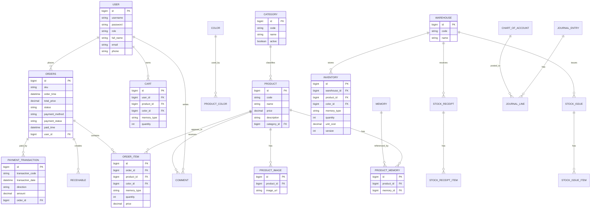

# Tài liệu phân tích nghiệp vụ và kỹ thuật - Dự án AppleShop

## 1. Tổng quan hệ thống

AppleShop là hệ thống thương mại điện tử bán sản phẩm Apple, gồm ba lớp chính:
- Frontend React cho khách hàng và quản trị viên.
- Backend Java Spring Boot xử lý nghiệp vụ bán hàng, kho, đơn hàng, thanh toán và kế toán.
- Backend Python FastAPI cho chatbot tư vấn sản phẩm.

### 1.1 Mục tiêu hệ thống
- Hỗ trợ quy trình mua hàng online trọn vẹn: xem sản phẩm, giỏ hàng, đặt hàng, thanh toán, theo dõi đơn.
- Quản lý sản phẩm theo danh mục, màu sắc, bộ nhớ và tồn kho theo kho.
- Đồng bộ trạng thái thanh toán VNPay và cập nhật lại đơn hàng theo thời gian thực.
- Ghi nhận các nghiệp vụ kế toán, kho và đánh giá sản phẩm theo từng use case.

### 1.2 Tác nhân chính
- Người dùng.
- Quản trị viên.
- VNPay.
- Hệ thống kế toán nội bộ.

## 2. Phân tích chi tiết từng use case

### UC01 - Đăng nhập
- Mục tiêu: Xác thực tài khoản và tạo phiên đăng nhập hợp lệ.
- Tác nhân: Người dùng.
- Tiền điều kiện: Người dùng đã có tài khoản hợp lệ trong hệ thống.
- Hậu điều kiện: Hệ thống trả về JWT token và phân quyền theo vai trò.
- Luồng chính:
  1. Người dùng mở màn hình đăng nhập và nhập tên đăng nhập, mật khẩu.
  2. Giao diện gửi `POST /api/login` đến `UserAPI`.
  3. `UserAPI` gọi `UserService.login(userName, password)`.
  4. `UserService` truy vấn bảng `user` theo trường `username`.
  5. Hệ thống so sánh mật khẩu bằng BCrypt với trường `password`.
  6. Nếu hợp lệ, hệ thống sinh JWT token và trả về cho frontend.
- Luồng phụ:
  1. Nếu tên đăng nhập không tồn tại, hệ thống trả lỗi “Tên người dùng không tồn tại”.
  2. Nếu mật khẩu không đúng, hệ thống trả lỗi “Mật khẩu không chính xác”.
- Ngoại lệ:
  1. Nếu thiếu dữ liệu đầu vào, controller trả `400 Bad Request`.
  2. Nếu phát sinh lỗi CSDL, use case dừng và không sinh token.
- Bảng truy cập: `user`.

### UC02 - Đăng ký
- Mục tiêu: Tạo tài khoản khách hàng mới.
- Tác nhân: Người dùng.
- Tiền điều kiện: Username chưa tồn tại trong hệ thống.
- Hậu điều kiện: Bản ghi mới được tạo trong bảng `user` với vai trò mặc định là customer.
- Luồng chính:
  1. Người dùng chọn chức năng đăng ký và nhập thông tin tài khoản.
  2. Giao diện gửi `POST /api/signup` đến `UserAPI`.
  3. `UserAPI` gọi `UserService.save(UserDTO)`.
  4. `UserService` kiểm tra `username` đã tồn tại hay chưa bằng `userRepository.findByUsername()`.
  5. Nếu hợp lệ, hệ thống gán `role = ROLE_CUSTOMER` và băm mật khẩu bằng BCrypt.
  6. Hệ thống lưu bản ghi mới vào bảng `user` và trả về `UserDTO`.
- Luồng phụ:
  1. Nếu `username` đã được sử dụng, hệ thống trả lỗi “Username đã được sử dụng”.
  2. Nếu dữ liệu nhập không hợp lệ, controller trả `400 Bad Request`.
- Ngoại lệ:
  1. Nếu lỗi lưu dữ liệu xảy ra trong quá trình ghi DB, use case kết thúc và không tạo tài khoản.
- Bảng truy cập: `user`.

### UC03 - Xem danh mục
- Mục tiêu: Cho phép người dùng xem danh sách danh mục sản phẩm.
- Tác nhân: Người dùng, quản trị viên.
- Tiền điều kiện: Bảng `category` đã có dữ liệu hợp lệ.
- Hậu điều kiện: Giao diện hiển thị danh sách danh mục.
- Luồng chính:
  1. Người dùng mở màn hình danh mục.
  2. Giao diện gọi `GET /api/category` đến `CategoryAPI`.
  3. `CategoryAPI` gọi `CategoryService.getAllCategory()`.
  4. Service truy vấn toàn bộ bản ghi trong bảng `category`.
  5. Mỗi bản ghi được chuyển sang `CategoryDTO` và trả về frontend.
- Luồng phụ:
  1. Nếu danh sách rỗng, hệ thống trả về danh sách trống để giao diện hiển thị trạng thái không có dữ liệu.
- Ngoại lệ:
  1. Nếu lỗi truy vấn CSDL xảy ra, API trả lỗi cho frontend.
- Bảng truy cập: `category`.

### UC04 - Xem thông tin sản phẩm
- Mục tiêu: Hiển thị chi tiết sản phẩm trước khi mua.
- Tác nhân: Người dùng, quản trị viên.
- Tiền điều kiện: Sản phẩm đã tồn tại và chưa bị xóa.
- Hậu điều kiện: Người dùng xem được thông tin chi tiết, ảnh, màu sắc, bộ nhớ và tồn kho biến thể.
- Luồng chính:
  1. Người dùng mở trang danh sách hoặc trang chi tiết sản phẩm.
  2. Giao diện gọi `GET /api/product`, `GET /api/product/{device}` hoặc `GET /api/product/code/{code}`.
  3. `ProductAPI` gọi các hàm tương ứng trong `ProductService`.
  4. Service đọc dữ liệu từ các bảng `product`, `product_image`, `product_memory`, `product_color`, `comment`, `inventory`.
  5. Với `getProductByCode()`, hệ thống dựng tồn kho biến thể theo từng `memoryType` và `color`.
  6. Hệ thống trả về `ProductDTO` hoặc `List<ProductDTO>` cho frontend.
- Luồng phụ:
  1. Nếu tìm theo `code` không thấy sản phẩm, hệ thống trả lỗi “Không tìm thấy sản phẩm”.
  2. Nếu có biến thể không còn tồn kho, frontend vẫn nhận được thông tin sản phẩm nhưng số lượng hiển thị bằng 0.
- Ngoại lệ:
  1. Nếu lỗi đọc bảng liên quan, API trả lỗi và không tạo dữ liệu giả.
- Bảng truy cập: `product`, `product_image`, `product_memory`, `product_color`, `comment`, `inventory`.

### UC05 - Cập nhật thông tin cá nhân
- Mục tiêu: Cho phép người dùng cập nhật thông tin tài khoản của chính mình.
- Tác nhân: Người dùng.
- Tiền điều kiện: Người dùng đã đăng nhập.
- Hậu điều kiện: Thông tin cá nhân trong bảng `user` được cập nhật thành công.
- Luồng chính:
  1. Người dùng mở trang hồ sơ cá nhân và thay đổi thông tin cần thiết.
  2. Giao diện gửi `PUT /api/user/{id}` đến `UserAPI`.
  3. `UserAPI` kiểm tra người dùng hiện tại qua `SecurityContextHolder` và `userRepository.findByUsername()`.
  4. Nếu hợp lệ, controller gọi `UserService.changeInfo(UserDTO, id)`.
  5. Service tìm bản ghi trong bảng `user` theo `id` và cập nhật các trường được phép.
  6. Hệ thống lưu dữ liệu và trả về thông báo thành công.
- Luồng phụ:
  1. Nếu người dùng không phải admin và không phải chủ tài khoản, hệ thống trả `403 Forbidden`.
  2. Nếu không tìm thấy người dùng, hệ thống trả lỗi “Không tìm thấy người dùng”.
- Ngoại lệ:
  1. Nếu lỗi hệ thống xảy ra trong lúc lưu, API trả `400 Bad Request`.
- Bảng truy cập: `user`.

### UC06 - Quản lý giỏ hàng
- Mục tiêu: Thêm, sửa, xóa sản phẩm trong giỏ hàng.
- Tác nhân: Người dùng.
- Tiền điều kiện: Người dùng đã đăng nhập và đã chọn đúng sản phẩm, màu sắc, bộ nhớ.
- Hậu điều kiện: Giỏ hàng trong bảng `cart` phản ánh đúng số lượng và sản phẩm hiện tại.
- Luồng chính:
  1. Người dùng bấm thêm vào giỏ hoặc chỉnh sửa giỏ hàng.
  2. Giao diện gọi `POST /api/cart`, `PUT /api/cart/{id}`, `DELETE /api/cart/{id}` hoặc `GET /api/cart/user/{id}`.
  3. `CartAPI` chuyển request đến `CartService`.
  4. `CartService` tìm bản ghi trong bảng `cart` theo bộ khóa nghiệp vụ `user_id`, `product_id`, `memory`, `color`.
  5. Nếu bản ghi đã tồn tại, hệ thống tăng `quantity`; nếu chưa có, tạo dòng mới với số lượng mặc định là 1.
  6. Hệ thống trả về `CartDTO` hoặc danh sách `CartDTO`.
- Luồng phụ:
  1. Nếu xóa một dòng giỏ hàng, service thực hiện xóa theo `id`.
  2. Nếu xóa toàn bộ giỏ theo user, service xóa tất cả bản ghi của người dùng đó.
- Ngoại lệ:
  1. Nếu lỗi lưu hoặc xóa dữ liệu, controller trả `400 Bad Request`.
- Bảng truy cập: `cart`.

### UC07 - Đặt hàng
- Mục tiêu: Chuyển giỏ hàng thành đơn hàng hoàn chỉnh.
- Tác nhân: Người dùng.
- Tiền điều kiện: Giỏ hàng có ít nhất một sản phẩm hợp lệ và thông tin nhận hàng đầy đủ.
- Hậu điều kiện: Bản ghi mới được tạo trong bảng `orders` và `order_item`.
- Luồng chính:
  1. Người dùng xác nhận đặt hàng từ giỏ hàng.
  2. Giao diện gửi `POST /api/order` đến `OrderAPI`.
  3. `OrderAPI` kiểm tra người dùng hiện tại; nếu không phải admin thì gán `userId` của tài khoản đang đăng nhập.
  4. `OrderAPI` gọi `OrderService.save(OrderDTO)`.
  5. Service lưu bản ghi vào bảng `orders` trước, sau đó lưu từng dòng vào bảng `order_item`.
  6. Hệ thống trừ tồn kho bằng `deductInventoryForOrder()` và ghi nhận kế toán bằng `AccountingPostingService.postOrderCreated()`.
  7. Hệ thống trả về `OrderDTO` của đơn hàng vừa tạo.
- Luồng phụ:
  1. Nếu đơn hàng có nhiều dòng, service xử lý từng `OrderItemDTO` tuần tự.
  2. Nếu sản phẩm hoặc biến thể không đủ tồn kho, hệ thống ném lỗi và quay lui giao dịch.
- Ngoại lệ:
  1. Nếu người dùng chưa đăng nhập, controller trả lỗi “Bạn chưa đăng nhập”.
  2. Nếu dữ liệu đơn hàng không hợp lệ, controller trả `400 Bad Request`.
- Bảng truy cập: `orders`, `order_item`, `inventory`, `stock_receipt_item`.

### UC08 - Thanh toán VNPay
- Mục tiêu: Hoàn tất giao dịch thanh toán đơn hàng qua VNPay sandbox và đồng bộ trạng thái đơn hàng.
- Tác nhân chính: Người dùng.
- Tác nhân phụ: VNPay.
- Tiền điều kiện: Đơn hàng đã được tạo từ dữ liệu checkout và người dùng chọn thanh toán VNPay.
- Hậu điều kiện: Đơn hàng được cập nhật `paymentStatus = Đã thanh toán`, có giao dịch kế toán và giỏ hàng được xóa sau khi IPN xác nhận thành công.
- Luồng chính:
  1. Người dùng bấm nút thanh toán VNPay trên giao diện.
  2. Frontend gửi `POST /api/vnpay/create-payment-url` kèm `order` và `returnUrl`.
  3. `VnpayAPI` gọi `VnpayService.createPaymentUrl()`.
  4. Service tạo đơn hàng với `paymentMethod = VNPAY_QR`, sinh payment URL sandbox và trả về `paymentUrl`, `orderId`, `sku`.
  5. Frontend chuyển người dùng sang cổng VNPay sandbox.
  6. Sau khi thanh toán, VNPay chuyển người dùng về `/payment-result` và đồng thời gọi IPN tới `/api/vnpay/ipn`.
  7. IPN xác thực chữ ký, đối chiếu số tiền, gọi `OrderService.markOrderPaid()` và xóa giỏ hàng của người dùng bằng `CartService.deleteByUserId()`.
  8. Trang `/payment-result` gọi lại `GET /api/order/{id}` để tự động đồng bộ và hiển thị trạng thái đơn hàng mới nhất.
- Luồng phụ:
  1. Nếu IPN đến chậm hơn trang kết quả, trang `/payment-result` hiển thị trạng thái đang đồng bộ trong vài giây.
  2. Nếu thanh toán VNPay thất bại, đơn hàng vẫn giữ trạng thái chưa thanh toán.
  3. Nếu chữ ký hoặc số tiền không hợp lệ, IPN bị từ chối và không cập nhật đơn hàng.
- Ngoại lệ:
  1. Nếu `order` hoặc `returnUrl` bị thiếu, backend trả lỗi `400 Bad Request`.
  2. Nếu IPN không hợp lệ, backend trả mã phản hồi tương ứng và không ghi DB.
- Bảng truy cập: `orders`, `cart`, và các bảng kế toán phát sinh trong `AccountingPostingService`.

#### UC08.1 - Trình tự xử lý kỹ thuật
- Điểm bắt đầu: Người dùng bấm thanh toán VNPay ở giao diện [appleshop-ui/src/pages/payment/index.js](../appleshop-ui/src/pages/payment/index.js).
- Frontend lấy `checkoutData` từ giỏ hàng, gán `paymentMethod = VNPAY_QR` và gọi `POST /api/vnpay/create-payment-url`.
- `VnpayAPI.createPaymentUrl()` nhận dữ liệu checkout, lấy IP người dùng và chuyển sang `VnpayService.createPaymentUrl()`.
- `VnpayService.createPaymentUrl()` lưu đơn hàng trước, sinh URL thanh toán và trả về `paymentUrl`, `orderId`, `sku`.
- `VnpayService.processIpn()` xác thực `vnp_SecureHash`, đối chiếu `vnp_TxnRef` và `vnp_Amount`, sau đó mới chốt thanh toán.
- Khi IPN hợp lệ và kết quả giao dịch là thành công, service gọi `OrderService.markOrderPaid(orderId)` rồi xóa giỏ hàng.
- Trang `/payment-result` lấy `vnp_TxnRef` từ query string, gọi `orderService.viewById()` để polling trạng thái đơn cho tới khi backend cập nhật xong.

#### UC08.2 - Bảng mapping chi tiết

| Bước | Controller / Service | Bảng tác động | Trường đọc | Trường ghi / cập nhật | Kết quả trả về |
|---|---|---|---|---|---|
| 1 | `VnpayAPI.createPaymentUrl(request)` | Không tác động DB trực tiếp | `order`, `returnUrl` | Không có | `paymentUrl`, `orderId`, `sku` |
| 2 | `VnpayService.createPaymentUrl()` | `orders` | `OrderDTO`, `totalPrice`, `userId` | `paymentMethod = VNPAY_QR` | URL thanh toán sandbox |
| 3 | `VnpayAPI.ipn(params)` / `VnpayService.processIpn()` | `orders` | `vnp_SecureHash`, `vnp_TxnRef`, `vnp_Amount`, `vnp_ResponseCode`, `vnp_TransactionStatus` | `paymentStatus`, `paidTime` | `RspCode`, `Message` |
| 4 | `OrderService.markOrderPaid()` | `orders` và các bảng kế toán liên quan | `orderId` | Đánh dấu đã thanh toán, ghi nhận kế toán | `OrderDTO` sau cập nhật |
| 5 | `CartService.deleteByUserId()` | `cart` | `userId` | Xóa giỏ hàng sau thanh toán thành công | Không trả body |
| 6 | `OrderAPI.getOrderById()` | Không tác động DB | `id` từ URL | Không có | `OrderDTO` để trang kết quả đồng bộ |

#### UC08.3 - Kết quả nghiệp vụ
- Nếu thanh toán thành công:
  - Đơn hàng được cập nhật sang trạng thái đã thanh toán.
  - Giao dịch thanh toán được ghi nhận.
  - Giỏ hàng của người dùng được xóa.
  - Trang `/payment-result` có thể hiển thị “Đã thanh toán” sau khi polling lấy được đơn mới nhất.
- Nếu thanh toán thất bại:
  - `orders.paymentStatus` không đổi.
  - Không sinh giao dịch thanh toán mới.
  - Trang kết quả hiển thị thất bại và cho phép người dùng thử lại.
- Nếu dữ liệu không hợp lệ:
  - IPN trả mã phản hồi phù hợp và không ghi DB.

### UC09 - Xem đơn hàng
- Mục tiêu: Cho phép người dùng xem lịch sử và chi tiết đơn hàng đã đặt.
- Tác nhân: Người dùng.
- Tiền điều kiện: Người dùng đã đăng nhập.
- Hậu điều kiện: Danh sách đơn hàng của người dùng được hiển thị.
- Luồng chính:
  1. Người dùng mở trang đơn hàng.
  2. Hệ thống truy vấn các đơn hàng theo người dùng.
  3. Giao diện gọi `GET /api/order/user/{id}` hoặc `GET /api/order`.
  4. `OrderAPI` kiểm tra quyền truy cập qua `getCurrentUserOrThrow()`.
  5. Nếu hợp lệ, controller gọi `OrderService.getOrderByUserId()` hoặc `getAllOrder()`.
  6. Service đọc bảng `orders` và nạp dữ liệu con từ `order_item` để dựng `OrderDTO`.
  7. Hệ thống trả về danh sách đơn hàng cho frontend.
- Luồng phụ:
  1. Nếu người dùng xem đơn của tài khoản khác mà không phải admin, hệ thống trả `403 Forbidden`.
  2. Nếu không có đơn nào, hệ thống trả danh sách rỗng.
- Ngoại lệ:
  1. Nếu lỗi truy vấn dữ liệu, API trả `400 Bad Request`.
- Bảng truy cập: `orders`, `order_item`, `payment_transaction`.

### UC10 - Cập nhật đơn hàng
- Mục tiêu: Cho phép quản trị viên hoặc người dùng được phép cập nhật trạng thái đơn.
- Tác nhân: Người dùng, quản trị viên.
- Tiền điều kiện: Đơn hàng tồn tại và trạng thái hiện tại cho phép cập nhật.
- Hậu điều kiện: Đơn hàng được cập nhật trạng thái hoặc thông tin liên quan.
- Luồng chính:
  1. Người dùng hoặc quản trị chọn đơn hàng cần xử lý.
  2. Giao diện gửi `PUT /api/order/confirm/{id}` và `PUT /api/order/change/{id}`.
  3. `OrderAPI` gọi `OrderService.updateStatusOrder()` hoặc `changeCheck()`.
  4. Service đọc bản ghi trong bảng `orders`, kiểm tra `status` hiện tại và xác minh trạng thái kế tiếp có hợp lệ hay không.
  5. Nếu hợp lệ, hệ thống cập nhật `status` và có thể cập nhật `paymentStatus` nếu request có truyền lên.
  6. Nếu cần, service trừ tồn kho theo FIFO/LIFO và đánh dấu `inventoryDeducted = true`.
  7. API trả về `OrderDTO` hoặc chuỗi `ok`.
- Luồng phụ:
  1. Nếu đơn đã ở trạng thái cuối, hệ thống không cho chuyển tiếp thêm.
  2. Nếu `changeCheck()` được gọi, hệ thống chỉ cập nhật cờ `checkCmt = 1`.
- Ngoại lệ:
  1. Nếu không tìm thấy đơn hàng, hệ thống trả lỗi.
  2. Nếu chuyển trạng thái không hợp lệ, hệ thống ném lỗi nghiệp vụ.
- Bảng truy cập: `orders`, `inventory`, `stock_issue`.

### UC11 - Đánh giá sản phẩm
- Mục tiêu: Cho phép người dùng gửi bình luận và đánh giá sản phẩm.
- Tác nhân: Người dùng, quản trị viên khi phản hồi.
- Tiền điều kiện: Người dùng đã đăng nhập và sản phẩm đã tồn tại.
- Hậu điều kiện: Bình luận hoặc phản hồi được lưu trong bảng `comment` và hiển thị trên trang sản phẩm.
- Luồng chính:
  1. Người dùng nhập nội dung đánh giá và điểm sao.
  2. Giao diện gọi `POST /api/comment` hoặc `POST /api/reply/{id}`.
  3. `CommentAPI` chuyển request đến `CommentService`.
  4. Service tạo hoặc cập nhật bản ghi trong bảng `comment`.
  5. Dữ liệu `comment`, `rating`, `product_id`, `user_id`, `reply`, `timeCmt`, `timeRep` được lưu tùy theo hành động.
  6. Hệ thống trả về `CommentDTO`.
- Luồng phụ:
  1. Nếu admin phản hồi, hệ thống cập nhật trường `reply` và `admin_id`.
  2. Nếu sửa phản hồi, hệ thống gọi `changeReply()`.
  3. Nếu xóa phản hồi, hệ thống chỉ đặt `reply = null`.
- Ngoại lệ:
  1. Nếu bản ghi không tồn tại khi sửa hoặc xóa, service có thể phát sinh lỗi và API trả `400 Bad Request`.
- Bảng truy cập: `comment`.

### UC12 - Quản lý người dùng
- Mục tiêu: Cho phép quản trị viên quản lý tài khoản người dùng.
- Tác nhân: Quản trị viên.
- Tiền điều kiện: Quản trị viên đã đăng nhập và có quyền quản lý người dùng.
- Hậu điều kiện: Dữ liệu người dùng hoặc vai trò được cập nhật.
- Luồng chính:
  1. Quản trị viên mở màn hình danh sách người dùng.
  2. Hệ thống hiển thị danh sách `UserEntity` và phân quyền hiện tại.
  3. Quản trị viên có thể cập nhật thông tin, cấp quyền hoặc xóa tài khoản.
  4. Giao diện gọi `GET /api/user`, `GET /api/user/{id}`, `PUT /api/user/{id}`, `PUT /api/user/{id}/role` hoặc `PUT /api/user/batch/role`.
  5. `UserAPI` kiểm tra quyền admin bằng `getCurrentUserOrThrow()` và `isAdmin()`.
  6. `UserService` truy vấn và cập nhật bảng `user`.
- Luồng phụ:
  1. Nếu admin sửa hàng loạt vai trò, service duyệt từng phần tử trong `BatchRoleUpdateDTO`.
  2. Nếu một phần tử thiếu `userId` hoặc `role`, phần tử đó bị tính là thất bại.
- Ngoại lệ:
  1. Nếu không tìm thấy người dùng, hệ thống trả lỗi.
  2. Nếu vai trò không hợp lệ, hệ thống ném lỗi “Vai trò không hợp lệ”.
- Bảng truy cập: `user`.

### UC13 - Cập nhật sản phẩm
- Mục tiêu: Cho phép quản trị viên tạo mới và chỉnh sửa sản phẩm.
- Tác nhân: Quản trị viên.
- Tiền điều kiện: Quản trị viên đã đăng nhập và có quyền quản lý sản phẩm.
- Hậu điều kiện: `product` và các dữ liệu liên quan được cập nhật.
- Luồng chính:
  1. Quản trị viên mở form sản phẩm.
  2. Người dùng tạo mới hoặc chỉnh sửa giá, mô tả, trạng thái, hình ảnh.
  3. Giao diện gọi `POST /api/product` hoặc `PUT /api/product/{id}`.
  4. `ProductAPI` chuyển request đến `ProductService.save(ProductDTO)`.
  5. Service kiểm tra `code`, `categoryCode`, danh sách màu và danh sách bộ nhớ.
  6. Service tìm `CategoryEntity`, `ColorEntity`, `MemoryEntity` và kiểm tra tồn kho tương ứng trong `inventory`.
  7. Nếu hợp lệ, hệ thống lưu `product`, cập nhật `product_memory`, và liên kết `product_color`.
  8. Hệ thống trả về `ProductDTO`.
- Luồng phụ:
  1. Nếu xóa sản phẩm nhưng vẫn còn tồn kho, hệ thống không cho phép xóa.
  2. Nếu bộ nhớ chưa có tồn kho, service ném lỗi và yêu cầu nhập kho trước.
- Ngoại lệ:
  1. Nếu mã sản phẩm trống, hệ thống trả lỗi “Mã sản phẩm là bắt buộc”.
  2. Nếu danh mục không tồn tại, hệ thống trả lỗi `NotFoundException`.
- Bảng truy cập: `product`, `product_image`, `product_memory`, `product_color`, `inventory`.

### UC14 - Cập nhật danh mục
- Mục tiêu: Quản trị các danh mục sản phẩm.
- Tác nhân: Quản trị viên.
- Tiền điều kiện: Quản trị viên đã đăng nhập.
- Hậu điều kiện: Danh mục mới hoặc thay đổi của danh mục được lưu trong bảng `category`.
- Luồng chính:
  1. Admin mở màn hình danh mục.
  2. Giao diện gọi `POST /api/category`, `PUT /api/category/{id}`, `DELETE /api/category/{id}` hoặc `GET /api/category`.
  3. `CategoryAPI` gọi `CategoryService.save()` hoặc `CategoryService.delete()`.
  4. Service ghi hoặc cập nhật bản ghi trong bảng `category`.
  5. Hệ thống trả về `CategoryDTO` hoặc danh sách `CategoryDTO`.
- Luồng phụ:
  1. Nếu xóa danh mục đang được sản phẩm tham chiếu, hành vi phụ thuộc vào ràng buộc dữ liệu của CSDL.
- Ngoại lệ:
  1. Nếu lỗi lưu dữ liệu, controller trả `400 Bad Request`.
- Bảng truy cập: `category`.

### UC15 - Cập nhật màu sắc
- Mục tiêu: Quản trị danh sách màu sắc sản phẩm.
- Tác nhân: Quản trị viên.
- Tiền điều kiện: Quản trị viên đã đăng nhập.
- Hậu điều kiện: Danh sách màu trong bảng `color` được cập nhật.
- Luồng chính:
  1. Admin mở màn hình quản lý màu sắc.
  2. Giao diện gọi `POST /api/color`, `PUT /api/color/{id}`, `DELETE /api/color/{id}` hoặc `GET /api/color`.
  3. `ColorAPI` chuyển request sang `ColorService`.
  4. Service lưu dữ liệu vào bảng `color` và trả về `ColorDTO`.
  5. Hệ thống trả kết quả về frontend.
- Luồng phụ:
  1. Nếu xóa màu đang được sản phẩm sử dụng, CSDL có thể ngăn xóa theo ràng buộc quan hệ.
- Ngoại lệ:
  1. Nếu lỗi lưu dữ liệu, controller trả lỗi phù hợp.
- Bảng truy cập: `color`.

### UC16 - Cập nhật bộ nhớ
- Mục tiêu: Quản trị các dung lượng bộ nhớ sản phẩm.
- Tác nhân: Quản trị viên.
- Tiền điều kiện: Quản trị viên đã đăng nhập.
- Hậu điều kiện: Bộ nhớ mới hoặc thay đổi của bộ nhớ được lưu trong bảng `memory`.
- Luồng chính:
  1. Admin mở màn hình quản lý bộ nhớ.
  2. Giao diện gọi `POST /api/memory`, `PUT /api/memory/{id}`, `DELETE /api/memory/{id}` hoặc `GET /api/memory`.
  3. `MemoryAPI` gọi `MemoryService`.
  4. Service ghi dữ liệu vào bảng `memory` và trả về `MemoryDTO`.
- Luồng phụ:
  1. Nếu xóa bộ nhớ đang được sản phẩm hoặc tồn kho tham chiếu, hệ thống cần ràng buộc dữ liệu tương ứng từ CSDL.
- Ngoại lệ:
  1. Nếu lỗi lưu dữ liệu, controller trả lỗi phù hợp.
- Bảng truy cập: `memory`.

### UC17 - Quản lý kho
- Mục tiêu: Quản lý kho, tồn kho và các nghiệp vụ nhập xuất liên quan.
- Tác nhân: Quản trị viên.
- Tiền điều kiện: Đã có danh mục kho và sản phẩm cần quản lý.
- Hậu điều kiện: `warehouse`, `inventory` và các phiếu nhập/xuất được cập nhật.
- Luồng chính:
  1. Quản trị viên mở màn hình kho.
  2. Hệ thống hiển thị thông tin kho và tồn kho theo từng sản phẩm.
  3. Quản trị viên tạo phiếu nhập, phiếu xuất hoặc điều chỉnh tồn.
  4. Hệ thống cập nhật `InventoryEntity` và ghi nhận lịch sử biến động.
  5. Giao diện gọi các API như `POST /api/warehouse`, `PUT /api/warehouse/{id}`, `POST /api/inventory/adjust`, `POST /api/stock-receipt`, `POST /api/stock-issue`.
- Luồng phụ:
  1. Nếu số lượng xuất lớn hơn tồn kho, hệ thống từ chối.
  2. Nếu kho không tồn tại hoặc không hợp lệ, hệ thống thông báo lỗi.
  3. Nếu xảy ra xung đột cập nhật, hệ thống báo conflict để xử lý lại.
- Ngoại lệ:
  1. Nếu điều chỉnh tồn làm số lượng nhỏ hơn 0, hệ thống không cho lưu.
  2. Nếu phiếu kho không có dòng hàng hợp lệ, hệ thống trả lỗi.
- Bảng truy cập: `warehouse`, `inventory`, `stock_receipt`, `stock_receipt_item`, `stock_issue`, `stock_issue_item`.

### UC18 - Quản lý kế toán
- Mục tiêu: Cung cấp báo cáo và công cụ kế toán tổng hợp.
- Tác nhân: Quản trị viên.
- Tiền điều kiện: Hệ thống đã có dữ liệu đơn hàng, thanh toán và phát sinh kế toán.
- Hậu điều kiện: Báo cáo, dashboard, công nợ và nhật ký kế toán được hiển thị đúng.
- Luồng chính:
  1. Quản trị viên mở màn hình kế toán.
  2. Hệ thống tổng hợp dữ liệu từ `OrderEntity`, `PaymentTransactionEntity`, `ReceivableEntity`, `PayableEntity` và `JournalEntryEntity`.
  3. Giao diện gọi các endpoint báo cáo, dashboard, sổ nhật ký, công nợ và đối chiếu.
  4. Hệ thống hiển thị doanh thu, giá vốn, lợi nhuận, công nợ và nhật ký.
  5. Quản trị viên có thể lọc theo khoảng ngày và xuất báo cáo nếu cần.
- Luồng phụ:
  1. Nếu khoảng ngày không hợp lệ, hệ thống không cho truy vấn.
  2. Nếu không có dữ liệu, hệ thống hiển thị trạng thái rỗng và giá trị 0.
- Ngoại lệ:
  1. Nếu lỗi tổng hợp, hệ thống thông báo lỗi và kết thúc use case.
- Bảng truy cập: `orders`, `stock_issue`, `stock_receipt_item`, `journal_entry`, `journal_line`, `receivable`, `payable`, `payment_transaction`, `expense_voucher`, `chart_of_account`, `inventory`.

### UC19 - Quản lý đơn hàng
- Mục tiêu: Cho phép quản trị viên theo dõi và xử lý toàn bộ đơn hàng.
- Tác nhân: Quản trị viên.
- Tiền điều kiện: Đơn hàng đã được tạo trong hệ thống.
- Hậu điều kiện: Đơn hàng được phân loại, xác nhận hoặc cập nhật trạng thái đúng quy trình.
- Luồng chính:
  1. Quản trị viên mở danh sách đơn hàng.
  2. Hệ thống hiển thị `OrderEntity` theo trạng thái, ngày tạo, khách hàng.
  3. Quản trị viên xem chi tiết, xác nhận, hủy hoặc cập nhật đơn.
  4. Giao diện gọi `GET /api/order`, `GET /api/order/user/{id}`, `PUT /api/order/confirm/{id}`, `PUT /api/order/payment/{id}` hoặc `PUT /api/order/change/{id}`.
  5. Hệ thống đồng bộ trạng thái đơn hàng với thanh toán, kho và kế toán.
- Luồng phụ:
  1. Nếu đơn hàng đã xử lý xong, hệ thống chặn sửa những trường không hợp lệ.
  2. Nếu không có quyền, hệ thống từ chối truy cập.
  3. Nếu cập nhật thất bại, hệ thống thông báo và giữ nguyên trạng thái cũ.
- Ngoại lệ:
  1. Nếu có xung đột trạng thái, service ném lỗi nghiệp vụ và controller trả `400 Bad Request`.
- Bảng truy cập: `orders`, `order_item`, `inventory`, `stock_issue`, `payment_transaction`, `receivable`.

## 3. Thiết kế cơ sở dữ liệu

### 3.1 Các nhóm bảng chính
- Nhóm tài khoản: `user`.
- Nhóm danh mục và sản phẩm: `category`, `product`, `product_image`, `product_color`, `product_memory`, `color`, `memory`.
- Nhóm bán hàng: `cart`, `orders`, `order_item`, `comment`.
- Nhóm kho: `warehouse`, `inventory`, `stock_receipt`, `stock_receipt_item`, `stock_issue`, `stock_issue_item`.
- Nhóm thanh toán và kế toán: `payment_transaction`, `receivable`, `payable`, `journal_entry`, `journal_line`, `chart_of_account`, `expense_voucher`.

### 3.2 ERD tổng quan

### 3.3 Thiết kế bảng cốt lõi

| Bảng | Khóa chính | Khóa ngoại / ràng buộc | Trường chính | Ghi chú |
|---|---|---|---|---|
| `user` | `id` | `username` duy nhất | `username`, `password`, `role`, `full_name`, `email`, `phone` | Lưu thông tin tài khoản và phân quyền |
| `category` | `id` | `code` duy nhất | `code`, `name`, `active` | Danh mục sản phẩm |
| `product` | `id` | `category_id` | `code`, `name`, `price`, `status`, `description` | Sản phẩm chính |
| `product_image` | `id` | `product_id` | `image_url`, `sort_order` | Ảnh sản phẩm |
| `product_memory` | `id` | `product_id`, `memory_id` | `memory_type` | Liên kết sản phẩm với bộ nhớ |
| `cart` | `id` | `user_id`, `product_id`, `color_id` | `quantity`, `memory_type`, `price` | Giỏ hàng theo biến thể |
| `orders` | `id` | `user_id` | `sku`, `status`, `payment_method`, `payment_status`, `total_price`, `paid_time` | Đơn hàng |
| `order_item` | `id` | `order_id`, `product_id`, `color_id` | `quantity`, `price`, `memory_type` | Chi tiết đơn hàng |
| `comment` | `id` | `product_id`, `user_id`, `admin_id` | `comment`, `reply`, `rating`, `timeCmt`, `timeRep` | Bình luận và phản hồi |
| `warehouse` | `id` | `code` duy nhất | `code`, `name` | Danh mục kho |
| `inventory` | `id` | `warehouse_id`, `product_id`, `color_id`, `memory_type` | `quantity`, `unit_cost`, `version` | Tồn kho biến thể |
| `stock_receipt` | `id` | `code` duy nhất | `receipt_date`, `warehouse_id`, `total_amount` | Phiếu nhập |
| `stock_receipt_item` | `id` | `stock_receipt_id`, `product_id` | `quantity`, `remaining_quantity`, `unit_cost` | Dòng phiếu nhập |
| `stock_issue` | `id` | `code` duy nhất | `issue_date`, `warehouse_id`, `total_amount` | Phiếu xuất |
| `stock_issue_item` | `id` | `stock_issue_id`, `product_id` | `quantity`, `unit_cost` | Dòng phiếu xuất |
| `payment_transaction` | `id` | `transaction_code` duy nhất, `order_id` | `transaction_date`, `direction`, `amount`, `status`, `reference_no` | Giao dịch thanh toán |
| `receivable` | `id` | `document_code` duy nhất | `outstanding_amount`, `status`, `due_date` | Công nợ phải thu |
| `payable` | `id` | `document_code` duy nhất | `outstanding_amount`, `status`, `due_date` | Công nợ phải trả |
| `journal_entry` | `id` | `entry_number` duy nhất | `entry_date`, `entry_type`, `source_type`, `source_id`, `posting_status` | Nhật ký kế toán |
| `journal_line` | `id` | `journal_entry_id`, `account_id` | `debit_amount`, `credit_amount` | Dòng bút toán |
| `chart_of_account` | `id` | `account_code` duy nhất | `account_name`, `account_type`, `parent_id` | Hệ thống tài khoản |

### 3.4 Ràng buộc dữ liệu quan trọng
- `inventory` dùng khóa nghiệp vụ theo tổ hợp `warehouse_id + product_id + color_id + memory_type`.
- `order.sku`, `payment_transaction.transaction_code`, `stock_receipt.code`, `stock_issue.code` phải duy nhất.
- `comment.rating` nằm trong khoảng hợp lệ theo quy ước giao diện.
- `orders.paymentStatus` chỉ đổi sang “Đã thanh toán” khi VNPay IPN hợp lệ hoặc trạng thái thanh toán được xác nhận từ backend.

## 4. Thiết kế test case

### 4.1 Bảng test case chức năng

| TC ID | Mục tiêu | Tiền điều kiện | Dữ liệu test | Bước kiểm thử | Kết quả mong đợi |
|---|---|---|---|---|---|
| TC01 | Đăng nhập thành công | Có tài khoản hợp lệ | Username, password đúng | Gọi API login | Trả JWT token |
| TC02 | Đăng nhập sai mật khẩu | Có tài khoản hợp lệ | Password sai | Gọi API login | Báo lỗi mật khẩu không chính xác |
| TC03 | Đăng ký tài khoản mới | Username chưa tồn tại | Thông tin đăng ký hợp lệ | Gọi API signup | Tạo user mới với role customer |
| TC04 | Xem danh mục | Có dữ liệu category | Không cần dữ liệu đặc biệt | Gọi API category | Trả danh sách danh mục |
| TC05 | Xem chi tiết sản phẩm | Có sản phẩm hợp lệ | `code` sản phẩm | Gọi API product/code | Trả thông tin sản phẩm và biến thể |
| TC06 | Thêm sản phẩm vào giỏ | Đã đăng nhập | Product, color, memory hợp lệ | Gọi API cart | Tạo dòng giỏ hàng hoặc tăng số lượng |
| TC07 | Đặt hàng từ giỏ | Giỏ hàng có dữ liệu | Địa chỉ, số điện thoại, item giỏ | Gọi API order | Tạo `orders` và `order_item` |
| TC08 | Thanh toán VNPay thành công | Đơn hàng đã tạo | Return URL hợp lệ | Tạo payment URL, quay về IPN | Đơn đổi sang đã thanh toán |
| TC09 | IPN VNPay sai chữ ký | Có request IPN giả | Hash không hợp lệ | Gọi API IPN | Từ chối cập nhật đơn |
| TC10 | Trang payment-result tự đồng bộ | Đơn vừa thanh toán | `vnp_TxnRef` hợp lệ | Mở trang payment-result | Hiển thị trạng thái mới nhất |
| TC11 | Xem lịch sử đơn hàng | Đã đăng nhập | `userId` hợp lệ | Gọi API order/user/{id} | Trả danh sách đơn của user |
| TC12 | Cập nhật trạng thái đơn | Đơn đang xử lý | Trạng thái mới hợp lệ | Gọi API order/confirm hoặc change | Cập nhật status thành công |
| TC13 | Gửi bình luận sản phẩm | Đã đăng nhập | Nội dung, rating | Gọi API comment | Lưu vào bảng comment |
| TC14 | Phản hồi bình luận | Có comment gốc | Nội dung reply | Gọi API reply | Cập nhật trường reply |
| TC15 | Quản lý người dùng | Đăng nhập admin | Vai trò mới, thông tin mới | Gọi API user/role | Cập nhật user thành công |
| TC16 | Quản lý sản phẩm | Đăng nhập admin | Thông tin sản phẩm mới | Gọi API product | Lưu product và dữ liệu liên quan |
| TC17 | Nhập kho | Có warehouse và product | Phiếu nhập hợp lệ | Gọi API stock-receipt | Tăng tồn kho |
| TC18 | Xuất kho | Có tồn kho | Phiếu xuất hợp lệ | Gọi API stock-issue | Giảm tồn kho |
| TC19 | Xem báo cáo kế toán | Có dữ liệu phát sinh | Khoảng ngày hợp lệ | Gọi API accounting/report | Trả doanh thu, giá vốn, lợi nhuận |

### 4.2 Bảng kết quả kiểm thử chi tiết

| TC ID | Điều kiện đầu vào | Kết quả mong đợi | Trạng thái |
|---|---|---|---|
| TC01 | Tài khoản đúng, mật khẩu đúng | Hệ thống trả JWT token và chuyển vào ứng dụng | Chưa chạy |
| TC02 | Mật khẩu sai | Hệ thống báo lỗi xác thực | Chưa chạy |
| TC03 | Username chưa tồn tại | Tạo user mới thành công | Chưa chạy |
| TC04 | Danh mục đã có dữ liệu | Danh sách danh mục hiển thị đầy đủ | Chưa chạy |
| TC05 | Có mã sản phẩm hợp lệ | Hiển thị đầy đủ thông tin sản phẩm | Chưa chạy |
| TC06 | Sản phẩm hợp lệ trong giỏ | Giỏ hàng cập nhật đúng số lượng | Chưa chạy |
| TC07 | Đơn hàng hợp lệ | Tạo đơn hàng, item và trừ tồn kho | Chưa chạy |
| TC08 | Thanh toán VNPay thành công | Đơn được đánh dấu đã thanh toán, giỏ hàng bị xóa | Chưa chạy |
| TC09 | IPN giả mạo | Không cập nhật đơn hàng | Chưa chạy |
| TC10 | Trang payment-result mở sau giao dịch | Trạng thái thanh toán tự cập nhật sau polling | Chưa chạy |
| TC11 | User xem đơn của chính mình | Trả danh sách đơn đúng tài khoản | Chưa chạy |
| TC12 | Admin đổi trạng thái đơn | Trạng thái đơn thay đổi hợp lệ | Chưa chạy |
| TC13 | Gửi bình luận hợp lệ | Bình luận được lưu và hiển thị | Chưa chạy |
| TC14 | Trả lời bình luận | Trường reply được cập nhật | Chưa chạy |
| TC15 | Admin đổi role user | Quyền mới được lưu thành công | Chưa chạy |
| TC16 | Lưu sản phẩm mới | Sản phẩm và dữ liệu liên quan được ghi DB | Chưa chạy |
| TC17 | Nhập kho với số lượng hợp lệ | Tồn kho tăng đúng số lượng | Chưa chạy |
| TC18 | Xuất kho vượt tồn | Hệ thống từ chối giao dịch | Chưa chạy |
| TC19 | Báo cáo kế toán theo khoảng ngày | Trả đúng số liệu tổng hợp | Chưa chạy |

## 5. Kết luận ngắn

Tài liệu này mô tả lại toàn bộ 19 use case của AppleShop theo ba lớp: nghiệp vụ, cơ sở dữ liệu và kiểm thử. Luồng VNPay được viết đúng với hiện trạng code: tạo URL thanh toán ở backend, xác nhận qua IPN, và đồng bộ lại đơn hàng trên trang `/payment-result`.